# 家用路由器 ACS 算法详细设计文档

## 1. 文档目的

本文档定义一套面向家用路由器与家庭 Mesh 组网的自动信道选择 `ACS` 算法方案。文档覆盖需求分解、算法原理、评分模型、环境识别、业务识别、自学习、DFS 雷达避让、多 AP 协同、状态机、程序架构、数据结构、接口设计、关键 C 代码、参数设计、测试方案和复现步骤。

本文档用于以下工作：

1. 详细设计评审
2. 固件软件开发
3. 联调与验证
4. 测试用例编写
5. 后续版本迭代

本文档采用工程化落地方式编写，目标是让研发、测试、项目、维护人员依据本文档直接完成实现与验证。

## 2. 设计目标

### 2.1 适用定位

本方案定位于家用路由器，覆盖以下形态：

1. 单 AP 双频路由器
2. 单 AP 三频路由器
3. 家庭 Mesh 主从节点组网
4. 带 DFS 频段能力的 5G/6G 路由器

> **版本范围**：当前版本覆盖 802.11a/b/g/n/ac/ax（Wi-Fi 6/6E），支持 20/40/80/160MHz 频宽和最多 4SS。Wi-Fi 7（802.11be）的 320MHz 频宽、MLO（多链路操作）、Multi-RU 等特性不在当前版本实现范围内；相关数据结构（如 `channel_metrics_t` 的 `bandwidth_mhz` 字段使用 `uint8_t`，上限 255MHz）已预留扩展点，后续升级时需重新评估评分模型中频宽权重和 MLO 场景下的多链路协同策略。

### 2.2 核心目标

1. 自动选择质量更优、吞吐更高、稳定性更强的工作信道
2. 在周期性优化和空闲窗口内完成主动优化
3. 在不同环境下采用不同权重进行评分
4. 支持 DFS 雷达避让并保证监管域合规
5. 支持家庭 Mesh 多 AP 协同选信道
6. 通过抑制机制防止频繁切换
7. 将业务体验保护放在切换决策之前
8. 支持业务类型感知与差异化切换策略
9. 支持基于 flow classify CSV 历史数据的业务学习
10. 支持业务模式变化后的自适应收敛

### 2.3 结果要求

1. 文档可直接指导编码
2. 文档可直接指导测试
3. 文档可直接指导参数调优
4. 文档可直接指导评审

## 3. 需求到设计映射

| 需求 | 设计落点 |
|---|---|
| 家用路由器定位 | 资源约束、低打扰扫描、客户端非协同、家用业务优先级模型 |
| 周期性/空闲状态优化 | `Periodic Optimizer`（周期优化器）、`Safe Window Gate`（安全窗口门控）、时隙学习 |
| 先环境识别再评分 | `Environment Identification Module`（环境识别模块）、环境权重矩阵 |
| DFS 雷达避让 | `DFS Manager`（DFS 管理器）、监管域参数表、应急逃生流程 |
| Mesh 多 AP 协同 | `Mesh Coordinator`（Mesh 协调器）、网络级评分函数 |
| 不频繁切换 | 最短驻留时间、冷却时间、切换阈值、连续获胜次数 |
| 不影响业务体验 | 业务保护门、队列阈值、实时业务冻结 |
| 不同业务策略 | 业务分类表、切换策略矩阵 |
| 自学习业务类型 | CSV 历史学习、时隙概率模型、EWMA 更新 |
| 自适应业务变化 | 短期/长期分布漂移检测、模型重权重 |
| CSV 读取功能 | C 语言 CSV 解析模块与 flow classify 输出的流量分类 CSV 文件 |
| 可复现、可开发、可测试 | 模块接口、伪代码、流程图、关键代码、测试矩阵 |

## 4. 总体设计原则

1. 先判断能否切换，再判断是否值得切换
2. 先保护业务体验，再追求更高信道分数
3. 先环境分类，再套用评分权重
4. 先网络级协同，再做单 AP 局部最优
5. DFS 场景先满足合规，再追求性能
6. 评分模型只使用固件可稳定采集的指标
7. 所有切换都经过抖动抑制链路
8. 默认不做全信道评分，只监控当前信道健康度
9. 只有当前信道健康度不达标时，才触发全信道扫描与候选评分（被动优化路径）
10. 首次启动以及环境刷新周期到达或关键事件触发时，必须重新执行整体网络环境识别，刷新 `env_profile_t` 与基础权重缓存
11. 在被动优化路径之外，增设独立的定时全扫描路径（主动优化路径）：按长周期（默认 6 小时）在安全窗口内执行全信道扫描与候选评分，在信道质量正常时也能主动发现更优信道，避免长期"困于"次优信道

## 5. 影响信道质量和通信速率的主要因素

本章节定义必须纳入 ACS 的核心变量。所有变量都由驱动、`hostapd`、`nl80211`、芯片私有统计、Mesh 控制平面或固件业务分析模块采集。

### 5.1 空口质量相关因素

1. `Noise Floor`（噪声底）：决定有效信噪比上限
2. `Channel Busy Time`（信道忙时比）：反映空口竞争强度
3. `Co-Channel Interference`（同信道干扰）
4. `Adjacent-Channel Interference`（邻信道干扰）
5. 周边 BSS 数量与 RSSI 分布
6. 非 802.11 能量占空比
7. 重传率
8. 物理层错误率
9. `CCA` 失败率
10. DFS 雷达事件历史

### 5.2 速率相关因素

1. 频宽能力：20/40/80/160 MHz
2. 客户端频宽支持能力
3. 客户端空间流能力 `NSS`
4. 当前链路的 `MCS` 可达性
5. 信道利用率导致的有效吞吐折损
6. Mesh 回程链路容量
7. 上下行队列积压
8. 空口重传造成的净吞吐损失

### 5.3 稳定性相关因素

1. 当前信道历史稳定性
2. 切换后预期收益稳定性
3. DFS 不可用风险
4. Mesh 邻居信道耦合风险
5. 用户业务敏感度

## 6. 系统总体架构

### 6.1 系统主流程图

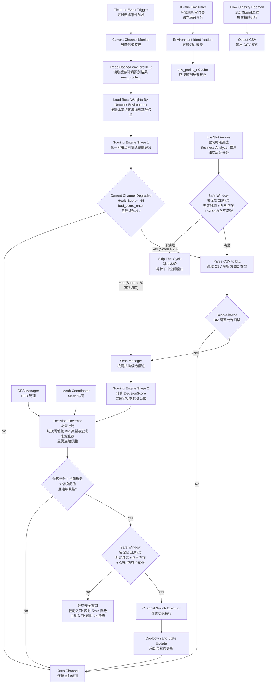

#### 6.1.1 流程图说明

1. `Current Channel Monitor`（当前信道监控）：只看当前工作信道是否已经变差。
2. `Read Cached env_profile_t`（读取缓存环境识别结果 `env_profile_t`）：先读取最近一次整体网络环境识别结果，不在每个周期重复全量识别环境。
3. `Load Base Weights By Network Environment`（按整体网络环境加载基础权重）：基础权重只能由整体网络环境结果生成，不能跳过环境直接评分。
4. `Scoring Engine Stage 1`（第一阶段当前信道健康评分）：只对当前信道打健康分，不做全信道比较。HealthScore = Σ Wi × Si，仅依赖环境权重和信道指标，不涉及业务类型。
5. `Current Channel Degraded`（得分过低）：将 HealthScore 与触发阈值比较，低于阈值且连续出现时才继续往下走。阈值不随业务变化。HealthScore < 20 时走强制切换分支，绕过 CSV 读取和 BIZ 门控，直接进入扫描阶段。
6. `Parse CSV to BIZ`（读取 CSV 解析为 BIZ 类型）：主流程读取 flow classify 输出的 CSV 文件，解析为 6 类 BIZ 类型（IDLE/WEB/VIDEO/CALL/GAME/BULK），供后续扫描许可和切换阈值判断使用。
7. `Scan Allowed`（BIZ 是否允许扫描）：根据解析出的 BIZ 类型判断是否允许主动扫描，若扫描对当前业务扰动过大则禁止。**强制切换例外**：HealthScore < 20 时走独立分支（Score < 20 分支），绕过 CSV 读取和 BIZ 门控，直接进入扫描阶段，切换阈值统一降为 8。
8. `Scan Manager`（按需扫描）：扫描候选信道并生成候选列表。
9. `Scoring Engine Stage 2`（第二阶段候选信道评分）：直接复用第一阶段已加载的环境权重，计算 DecisionScore（含固定切换代价公式，不依赖业务类型）。评分本身不涉及切换阈值比较。
10. `Decision Governor`（决策控制）→`Score Comparison`（R 节点）：判断候选 DecisionScore 减去当前信道 DecisionScore 是否超过业务差异化切换阈值（阈值由 BIZ 类型与触发来源查表决定），综合连续获胜等条件决定候选是否优于当前信道。
11. `DFS Manager`（DFS 管理）和 `Mesh Coordinator`（Mesh 协同）：分别提供 DFS 合规约束和多 AP 协同约束。
12. `Safe Window`（S 节点）：候选胜出后再次校验当前安全窗口（无实时流 + 队列空闲 + CPU/内存不紧张），防止扫描和评分期间业务状态变化。
13. `Wait Safe Window`（W 节点）：安全窗口不满足时进入等待。**超时策略按触发入口区分**——被动入口：5 分钟超时降级（txq<50%、sta≤8），降级切换后冷却缩短至 600s；主动入口：2 小时超时直接放弃本轮，不降级（避免空闲窗口预测不准时频繁降级扫描）。
14. `Channel Switch Executor`（信道切换执行）：真正执行切换动作。
15. `Cooldown and State Update`（冷却与状态更新）：更新状态并进入冷却期，避免频繁来回切换。
16. `10-min Env Timer -> Environment Identification -> Update Cached env_profile_t` 是独立的后台环境刷新路径，每 10 分钟通过滑动窗口定期更新缓存中的 `env_profile_t`，不嵌入主决策链路。
17. `Flow Classify Daemon -> Output CSV` 是独立的后台路径。flow classify 只持续产出 CSV 文件，不做解析。主链路在需要时读取 CSV 并解析为 6 类 BIZ 类型，用于判断扫描许可和切换阈值。
18. `Idle Slot Arrives -> Safe Window -> P1` 是独立的主动优化入口：Business Analyzer 基于 `test.csv` 历史数据学习用户空闲时段规律，预测到空闲窗口到来时触发 T3；进入前再校验当前安全窗口，通过后汇入 `Parse CSV to BIZ`（P1）节点，不通过则跳过等待下个空闲窗口。后续复用与被动路径完全相同的 BIZ 判断(J)→扫描(K)→评分(N)→决策(O)→比较(R)→安全窗口(S)流水线。区别在于：(a) 主动入口下 J 节点仅 IDLE/WEB/BULK 允许通过；(b) R 节点的切换阈值按触发来源区分（被动 8~14，主动 12~18）；(c) W 节点的安全窗口等待超时策略按入口区分——被动入口 5 分钟降级（txq<50%、sta≤8），主动入口 2 小时直接放弃本轮，不降级。

#### 6.1.2 阅读顺序

1. 先看左半部分：这是"先取环境，再取基础权重，再做当前信道守门"阶段（被动优化路径）。
2. 再看中间部分：这是"扫描候选信道，复用已加载权重直接评分"阶段。
3. 然后看右半部分：这是"候选比较、决策、执行切换"阶段。
4. `DFS Manager` 和 `Mesh Coordinator` 不是主链路节点，而是给决策控制器提供额外约束。
5. 最后看底部 T3 分支：这是独立的"定时全扫描"主动优化路径，与左侧被动优化路径并行运行，在信道不差时也能定期寻优。

### 6.2 程序分层架构图

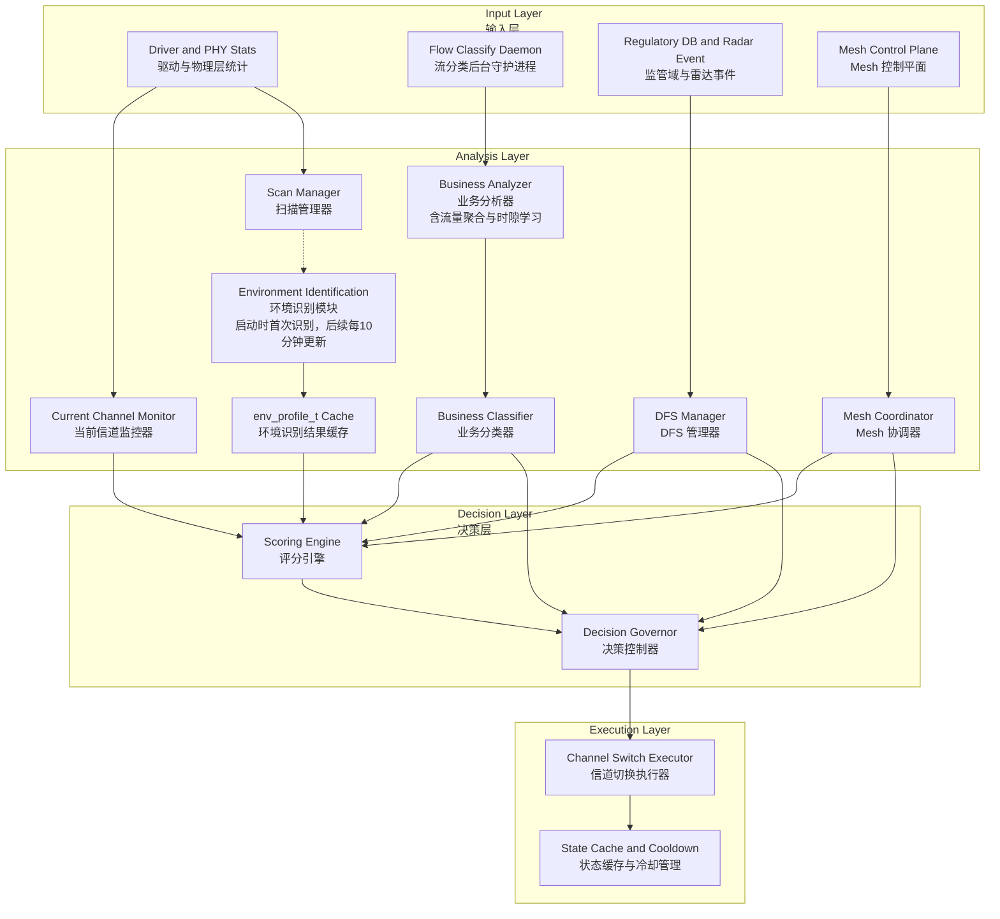

#### 6.2.1 分层架构图说明

1. 输入层负责提供原始数据来源，包括当前信道统计、流分类守护进程实时业务流量数据、DFS 事件和 Mesh 控制信息。业务流量数据由 `Flow Classify Daemon` 持续输出 CSV 文件提供。
2. 分析层负责把原始数据变成可决策的信息，包括业务类型、环境类型、扫描结果和 DFS 约束。`Business Analyzer`（业务分析器）统一承担流量聚合、时隙统计和历史忙闲规律学习，不再拆成两个模块。`Environment Identification`（环境识别模块）在启动时使用初始全信道扫描结果首次识别，后续每 10 分钟通过滑动窗口定期刷新 `env_profile_t` 缓存（虚线 `B4 -.-> B5` 表示扫描结果驱动环境识别的路径）；运行时评分引擎直接从 `env_profile_t Cache` 读取环境权重。`Flow Classify Daemon` 独立后台运行输出 CSV，评分引擎和决策控制器在需要时直接读取 CSV，不维护独立的 biz 缓存。
3. 决策层只做两件事：评分和裁决。
4. 执行层只负责真正切换信道和维护冷却状态，不负责重新判断策略。

### 6.3 模块职责

| 模块 | 输入 | 输出 | 功能 |
|---|---|---|---|
| `Current Channel Monitor`（当前信道监控器） | 驱动当前信道计数器 | 当前信道指标 | 低开销采样、健康度守门、扫描触发依据 |
| `Scan Manager`（扫描管理器） | 按需扫描事件、邻居 BSS 信息 | 候选信道指标 | 低频全信道扫描、低打扰扫描、邻居统计聚合 |
| `Environment Identification Module`（环境识别模块） | 扫描指标、拓扑信息 | `env_profile_t`（环境画像结果对象） | 环境识别与权重选择，结果缓存复用 |
| `Business Analyzer`（业务分析器） | 流分类守护进程实时输出、历史数据 | `csv_biz_sample_t`（业务样本聚合结果）、时隙繁忙提示 | 业务样本聚合、时隙统计、历史忙闲规律学习 |
| `Business Classifier`（业务分类器） | `csv_biz_sample_t`（业务样本聚合结果）、历史先验 | `biz_profile_t`（业务画像） | 基于流分类标签映射和二次修正规则输出 ACS 决策业务类型 |
| `Switch Guard Collector`（切换保护采集器） | 当前关联站点、发送队列、CPU、内存、体验事件 | `switch_guard_t`（切换保护画像） | 采集切换保护阈值，禁止把运行时保护指标混入业务识别 |
| `DFS Manager`（DFS 管理器） | 监管域参数、雷达事件 | DFS 状态与限制 | CAC、NOP、紧急避让、黑名单 |
| `Mesh Coordinator`（Mesh 协调器） | 各 AP 候选信道、回程质量 | 网络级约束 | 多 AP 协同信道分配 |
| `Scoring Engine`（评分引擎） | 当前信道指标或候选信道指标、环境、切换保护画像 | 当前分数或候选信道得分 | 两阶段评分 |
| `Decision Governor`（决策控制器） | 当前分数、候选得分、当前状态 | 扫描或切换决策 | 扫描抑制、防抖、业务保护、定时控制、按触发来源区分切换阈值 |
| `Channel Switch Executor`（信道切换执行器） | 决策结果 | 实际切换 | CSA、CAC、回滚、状态持久化 |

## 7. 整体网络环境识别设计

### 7.1 环境分类输入

整体网络环境分类使用一个滚动观测窗口内的聚合变量，不直接使用单次瞬时值。默认观测窗口为：

1. `INIT_FAST`（启动快速判定）：启动时即时快照
2. `WINDOW_PARTIAL`（部分窗口判定）：启动后 `0~10 min` 的部分窗口聚合
3. `WINDOW_STEADY`（稳定窗口判定）：最近 `10 min` 的滑动窗口聚合

环境分类使用以下可测量变量：

1. `foreign_bss_cnt_24g`：2.4G 周边 BSS 数
2. `foreign_bss_cnt_5g`：5G 周边 BSS 数
3. `busy_avg_24g`、`busy_avg_5g`：2.4G 和 5G 频段平均忙时占比
4. `strong_bss_ratio`：周边强干扰 AP 占比，阈值为 `RSSI >= -70 dBm`
5. `mesh_ap_cnt`：Mesh AP 数量
6. `backhaul_rssi_avg`：回程链路平均 `RSSI`（接收信号强度）
7. `dfs_radar_evt_7d`：7 天内 DFS 雷达事件次数
8. `dfs_cac_fail_cnt_7d`：7 天内 DFS `CAC`（信道可用性检测）失败次数
9. `cur_snr_db`：当前主服务链路信噪比的窗口均值
10. `coverage_edge_sta_ratio`：全屋边缘站点占比，阈值为 `RSSI <= -72 dBm`
11. `backhaul_busy_pct`：回程链路忙时比窗口均值
12. `backhaul_retry_pct`：回程链路重传率窗口均值

### 7.2 整体网络环境分类

环境识别不再判断部署地点类型，而是判断当前家庭网络的主要矛盾。定义五类整体网络环境：

1. `ENV_INTERFERENCE_HEAVY`（强干扰环境）
2. `ENV_WEAK_COVERAGE`（弱覆盖环境）
3. `ENV_BALANCED`（均衡环境）
4. `ENV_BACKHAUL_CONSTRAINED`（回程受压环境）
5. `ENV_DFS_SENSITIVE`（DFS 敏感环境）

### 7.2.1 主问题与次问题模型

整体网络环境识别采用“一个主问题 + 多个次问题标签”的方式工作。

1. 主问题用于决定基础权重矩阵
2. 次问题标签用于叠加权重修正量
3. 每个环境刷新周期只允许存在一个主问题
4. 次问题标签允许同时存在多个
5. 主问题环境不因为单次信道切换立即变化

主问题集合：

1. 强干扰
2. 弱覆盖
3. 回程受压
4. DFS 敏感
5. 均衡

次问题标签集合：

1. `TAG_INTERFERENCE`（干扰标签）
2. `TAG_COVERAGE`（覆盖标签）
3. `TAG_BACKHAUL`（回程标签）
4. `TAG_DFS`（DFS 标签）
5. `TAG_STABILITY_RISK`（稳定性风险标签）

### 7.3 环境判定规则

#### 7.3.1 强干扰环境

满足任一条件即判定为 `ENV_INTERFERENCE_HEAVY`（强干扰环境）：

1. `foreign_bss_cnt_24g >= 12`，即 2.4G 周边 BSS 数不少于 12 个
2. `foreign_bss_cnt_5g >= 8`，即 5G 周边 BSS 数不少于 8 个
3. `busy_avg_24g >= 45`，即 2.4G 频段平均忙时占比不低于 45%
4. `busy_avg_5g >= 40`，即 5G 频段平均忙时占比不低于 40%
5. `strong_bss_ratio >= 0.35`，即强干扰邻居 AP 占比不低于 35%

#### 7.3.2 弱覆盖环境

满足全部条件即判定为 `ENV_WEAK_COVERAGE`（弱覆盖环境）：

1. `cur_snr_db <= 18`，即当前主服务链路信噪比不高于 18 dB
2. `coverage_edge_sta_ratio >= 0.30`，即边缘站点占比不低于 30%
3. `busy_avg_24g < 45`，即 2.4G 频段平均忙时占比低于 45%
4. `busy_avg_5g < 40`，即 5G 频段平均忙时占比低于 40%

#### 7.3.3 回程受压环境

满足全部条件即判定为 `ENV_BACKHAUL_CONSTRAINED`（回程受压环境）：

1. `mesh_ap_cnt >= 2`，即 Mesh AP 数量不少于 2 个
2. 存在无线回程链路
3. `backhaul_busy_pct >= 55`（回程链路忙时比不低于 55%）或 `backhaul_retry_pct >= 15`（回程链路重传率不低于 15%）

#### 7.3.4 DFS 敏感环境

满足任一条件即判定为 `ENV_DFS_SENSITIVE`（DFS 敏感环境）：

1. `dfs_radar_evt_7d >= 1`，即 7 天内 DFS 雷达事件次数不少于 1 次
2. `dfs_cac_fail_cnt_7d >= 1`，即 7 天内 DFS `CAC`（信道可用性检测）失败次数不少于 1 次

#### 7.3.5 均衡环境

未命中以上条件时判定为 `ENV_BALANCED`（均衡环境）。

### 7.3.6 主问题判定顺序

主问题判定采用“先计算问题严重度，再按优先级选主问题”的机制。

定义五个问题严重度：

1. `severity_interference`：干扰问题严重度
2. `severity_coverage`：覆盖问题严重度
3. `severity_backhaul`：回程问题严重度
4. `severity_dfs`：DFS 问题严重度
5. `severity_balanced`：均衡状态严重度

严重度取值范围统一映射为 `0..100`。

主问题选择规则：

1. 先计算所有严重度
2. 若最高严重度 `< severity_balanced_threshold`（默认 35），主问题设置为 `ENV_BALANCED`
   - 阈值 35 的选择依据：严重度公式在"刚好触发环境判定条件"的边界输入下约输出 30-40 分，取中间值 35 作为信号区分线
   - 该阈值可配置，调高则更倾向判定为均衡环境（保守），调低则更倾向判定为具体问题（激进）
3. 若多个严重度同时超过阈值，选择严重度最高者
4. 若严重度相同，按优先级表裁决

### 7.3.7 优先级表

当多个问题严重度相同或接近时，按以下优先级裁决主问题：

| 优先级 | 主问题 | 原因 |
|---|---|---|
| 1 | `ENV_DFS_SENSITIVE` | 受监管约束，必须优先 |
| 2 | `ENV_BACKHAUL_CONSTRAINED` | Mesh 回程受损会放大全网性能损失 |
| 3 | `ENV_WEAK_COVERAGE` | 覆盖问题直接限制基础速率和稳定性 |
| 4 | `ENV_INTERFERENCE_HEAVY` | 干扰问题影响容量与时延 |
| 5 | `ENV_BALANCED` | 仅在无显著问题时使用 |

### 7.3.8 次问题标签判定规则

次问题标签独立判定，不受主问题唯一性限制。

1. `TAG_INTERFERENCE`：当 `busy_avg_24g >= 35`（2.4G 平均忙时占比不低于 35%）或 `busy_avg_5g >= 30`（5G 平均忙时占比不低于 30%）或 `strong_bss_ratio >= 0.25`（强干扰邻居 AP 占比不低于 25%）
2. `TAG_COVERAGE`：当 `cur_snr_db <= 20`（当前主服务链路信噪比不高于 20 dB）或 `coverage_edge_sta_ratio >= 0.20`（边缘站点占比不低于 20%）
3. `TAG_BACKHAUL`：当 `mesh_ap_cnt >= 2`（Mesh AP 数量不少于 2 个）且 (`backhaul_busy_pct >= 45`（回程链路忙时比不低于 45%）或 `backhaul_retry_pct >= 10`（回程链路重传率不低于 10%）)
4. `TAG_DFS`：当 `dfs_radar_evt_7d >= 1`（7 天内 DFS 雷达事件次数不少于 1 次）或 `dfs_cac_fail_cnt_7d >= 1`（7 天内 DFS `CAC` 失败次数不少于 1 次）
5. `TAG_STABILITY_RISK`：当 `score_variance >= 25`（信道评分波动度不低于 25）或 `history_good_ratio <= 70`（历史良好占比不高于 70%）

### 7.3.9 严重度计算方法

严重度采用归一化线性组合，确保实现简单、可解释、可调参。

```text
severity_interference =
    0.30 * Score_pos(foreign_bss_cnt_24g, 4, 16) +
    0.25 * Score_pos(foreign_bss_cnt_5g, 2, 12) +
    0.25 * Score_pos(max(busy_avg_24g, busy_avg_5g), 20, 80) +
    0.20 * Score_pos(strong_bss_ratio, 0.10, 0.50)

severity_coverage =
    0.45 * Score_neg(cur_snr_db, 10, 35) +
    0.35 * Score_pos(coverage_edge_sta_ratio, 0.10, 0.60) +
    0.20 * Score_neg(history_good_ratio, 50, 95)

severity_backhaul =
    0.45 * Score_pos(backhaul_busy_pct, 20, 90) +
    0.35 * Score_pos(backhaul_retry_pct, 5, 30) +
    0.20 * Score_neg(backhaul_rssi_avg, -75, -45)

severity_dfs =
    0.60 * Score_pos(dfs_radar_evt_7d, 0, 4) +
    0.40 * Score_pos(dfs_cac_fail_cnt_7d, 0, 3)
```

其中：

1. `Score_pos` 表示值越大问题越重
2. `Score_neg` 表示值越小问题越重
3. `severity_balanced = 100 - max(other severities)`
4. `foreign_bss_cnt_24g` 表示 2.4G 周边 BSS 数
5. `foreign_bss_cnt_5g` 表示 5G 周边 BSS 数
6. `busy_avg_24g`、`busy_avg_5g` 表示 2.4G 和 5G 频段平均忙时占比
7. `strong_bss_ratio` 表示强干扰邻居 AP 占比
8. `cur_snr_db` 表示当前主服务链路信噪比
9. `coverage_edge_sta_ratio` 表示边缘站点占比
10. `backhaul_busy_pct` 表示回程链路忙时比
11. `backhaul_retry_pct` 表示回程链路重传率
12. `backhaul_rssi_avg` 表示回程链路平均 `RSSI`（接收信号强度）
13. `history_good_ratio` 表示历史良好占比
14. `score_variance` 表示信道评分波动度
15. `dfs_radar_evt_7d` 表示 7 天内 DFS 雷达事件次数
16. `dfs_cac_fail_cnt_7d` 表示 7 天内 DFS `CAC`（信道可用性检测）失败次数

### 7.3.10 整体网络环境识别落地实现步骤

整体网络环境识别不是抽象判断，而是一段固定实现流程。具体步骤如下：

```text
1. 启动时 WiFi 上线后立即加载固件内置的默认均衡环境权重 W_default，确保评分引擎立即可用
2. 后台异步执行一次全信道扫描，收集 chs[]
3. 读取当前链路、站点覆盖、Mesh 回程、DFS 历史状态
4. 生成一次 INIT_FAST 快照环境输入
5. 立刻计算 severity_interference / severity_coverage / severity_backhaul / severity_dfs
6. 依据最高严重度和优先级表选择 main_env
7. 独立判定 TAG_INTERFERENCE / TAG_COVERAGE / TAG_BACKHAUL / TAG_DFS / TAG_STABILITY_RISK
8. 输出初始 env_profile_t 并替换 W_default → W_env，完成冷启动
9. 运行时每 60 s 更新一次窗口聚合器
10. 当窗口未满 10 min 时，使用 WINDOW_PARTIAL 聚合结果刷新 env_profile_t
11. 当窗口达到 10 min 后，使用 WINDOW_STEADY 滑动窗口结果刷新 env_profile_t
12. 当 DFS 事件、Mesh 拓扑变化、持续劣化（`degrade_confirm_cnt >= 3`）或大量终端变化发生时，立即触发 EVENT_REFRESH
13. EVENT_REFRESH 直接使用最新扫描和当前窗口聚合结果重算 env_profile_t，重置劣化计数器
14. 环境刷新完成后重新加载 W_env 并写入缓存
```

实现约束如下：

1. 启动阶段先加载默认均衡权重 W_default（固件内置），后台异步完成全信道扫描和环境识别后替换为 W_env
2. 周期阶段默认复用缓存 `env_profile_t`
3. 第一阶段只复用缓存环境，不重新识别环境
4. 第二阶段扫描后只在满足环境刷新条件时才刷新 `env_profile_t`
5. 信道切换完成后不立即重识别整体网络环境
6. 环境识别输入全部来自无线统计、Mesh 统计和 DFS 状态，不依赖业务类型
7. 整体网络环境刷新推荐周期为 `10 min`（与后台环境刷新定时器一致）
8. 滚动统计更新周期推荐为 `60 s`

### 7.3.11 环境识别伪代码

```c
int acs_build_env_profile(const channel_metrics_t *chs, size_t num,
                          const env_input_t *env_in, env_profile_t *profile)
{
    if (chs == NULL || num == 0 || env_in == NULL || profile == NULL) {
        return -EINVAL;
    }

    profile->severity_interference = calc_interference_severity(chs, num, env_in);
    profile->severity_coverage = calc_coverage_severity(chs, num, env_in);
    profile->severity_backhaul = calc_backhaul_severity(env_in);
    profile->severity_dfs = calc_dfs_severity(env_in);
    profile->severity_balanced = 100 - max4(profile->severity_interference,
                                            profile->severity_coverage,
                                            profile->severity_backhaul,
                                            profile->severity_dfs);

    profile->main_env = select_main_env(profile);
    profile->env_tags = build_env_tags(chs, num, env_in, profile);
    return 0;
}
```

这段实现说明如下：

1. `main_env` 只由整体网络观测指标决定
2. `env_tags` 只由整体网络观测指标决定
3. 业务类型不会参与环境主问题判定
4. 权重生成发生在 `env_profile_t` 输出之后
5. 候选信道评分只复用 `W_env`，不为每个候选单独识别环境

### 7.4 环境权重矩阵

评分项统一映射到 0 到 100。环境识别只负责生成权重，不直接生成最终分值。

#### 7.4.1 评分项定义

1. `S_busy`：忙时分数，越低越差
2. `S_cci`：同信道干扰分数
3. `S_aci`：邻信道干扰分数
4. `S_noise`：噪声分数
5. `S_rate`：速率潜力分数
6. `S_stability`：历史稳定性分数
7. `S_mesh`：Mesh 协同分数
8. `S_dfs`：DFS 风险分数
9. `S_switch_cost`：切换代价分数，代价越高则扣分越大

#### 7.4.2 基础权重

| 环境 | Busy | CCI | ACI | Noise | Rate | Stability | Mesh | DFS | SwitchCost |
|---|---:|---:|---:|---:|---:|---:|---:|---:|---:|
| `ENV_INTERFERENCE_HEAVY` | 0.20 | 0.20 | 0.14 | 0.08 | 0.12 | 0.10 | 0.04 | 0.04 | 0.08 |
| `ENV_WEAK_COVERAGE` | 0.10 | 0.08 | 0.06 | 0.12 | 0.24 | 0.20 | 0.06 | 0.04 | 0.10 |
| `ENV_BALANCED` | 0.14 | 0.12 | 0.08 | 0.10 | 0.22 | 0.14 | 0.06 | 0.04 | 0.10 |
| `ENV_BACKHAUL_CONSTRAINED` | 0.10 | 0.10 | 0.06 | 0.08 | 0.16 | 0.12 | 0.28 | 0.04 | 0.06 |
| `ENV_DFS_SENSITIVE` | 0.12 | 0.12 | 0.08 | 0.08 | 0.14 | 0.16 | 0.06 | 0.18 | 0.06 |

### 7.5 环境修正逻辑

环境识别采用主环境加修正标签的方式运行。若同时命中多个问题类型，则按主问题优先级生成主环境，再叠加修正量。

优先级如下：

1. `ENV_DFS_SENSITIVE`（DFS 敏感环境）
2. `ENV_BACKHAUL_CONSTRAINED`（回程受压环境）
3. `ENV_WEAK_COVERAGE`（弱覆盖环境）
4. `ENV_INTERFERENCE_HEAVY`（强干扰环境）
5. `ENV_BALANCED`（均衡环境）

最终权重按以下公式生成：

```text
W_final = Normalize(W_base + W_backhaul_delta + W_dfs_delta +
                    W_coverage_delta + W_stability_delta + W_interference_delta)
```

其中：

```text
W_backhaul_delta = [0, 0, 0, 0, -0.04, 0, +0.10, 0, -0.02]
W_dfs_delta      = [0, 0, 0, 0, -0.02, +0.02, 0, +0.08, 0]
W_coverage_delta = [-0.02, -0.02, 0, +0.02, +0.04, +0.04, 0, 0, -0.02]
W_stability_delta = [0, 0, 0, 0, -0.02, +0.06, 0, 0, -0.04]
W_interference_delta = [+0.04, +0.04, +0.02, 0, -0.04, 0, 0, 0, -0.06]
```

`Normalize` 表示对所有权重求和并归一化到 1.0。

### 7.5.1 多标签叠加规则

次问题标签修正按以下规则叠加：

1. 主问题对应的同类标签不再重复叠加
2. 每次最多叠加 2 个次问题标签
3. 若存在 `TAG_DFS`，始终优先保留
4. 其余标签按严重度从高到低选取
5. 叠加后统一执行 `Normalize`
6. `TAG_STABILITY_RISK` 命中时叠加 `W_stability_delta`

### 7.5.2 权重生成流程

```text
1. 采集环境输入指标
2. 计算 interference / coverage / backhaul / dfs 严重度
3. 选择主问题 env_main
4. 识别次问题标签 env_tags[]
5. 读取主问题基础权重 W_base
6. 叠加次问题修正量 Delta(tags)
7. 归一化得到环境基础权重 W_env
8. 输出 W_env 供评分引擎使用
```

### 7.5.3 工程化约束

1. 主问题至少保持 10 分钟，避免频繁跳变
2. 次问题标签至少连续命中 2 次才生效
3. 连续 3 个周期未命中标签条件时，移除该标签
4. 整体网络环境切换后清空候选连续获胜计数，防止跨环境继承旧决策

### 7.5.4 为什么必须先识别环境再加载权重

实现顺序必须固定为：`环境识别 -> 环境基础权重 -> 评分`。

原因如下：

1. 强干扰环境要优先处理 `busy / cci / aci`
2. 弱覆盖环境要优先处理 `rate / stability / noise`
3. 回程受压环境要优先处理 `mesh`
4. DFS 敏感环境要优先处理 `dfs / stability`
5. 若不先识别环境，评分引擎就无法知道该把哪个问题当成主矛盾
6. 业务只负责扫描门控、切换门控和阈值控制，不参与基础权重生成

## 8. 业务识别与自学习设计

### 8.1 业务分类

ACS 业务识别分为两层：

1. 上游原始应用类型 `app_type`（应用类型）
2. ACS 内部决策业务类型 `BIZ_*`（决策业务类型）

上游原始应用类型固定为以下 16 类：

```c
static const char* app_type_strings[] = {
    "unknown",       "social",       "video",  "shopping", "news",
    "music",         "productivity", "tech",   "cloud",    "lifestyle",
    "communication", "finance",      "game",   "storage",
    "security",      "iot",
};
```

约束说明：

1. `app_type_strings[]` 只表示上游原始应用类型标签集合
2. `app_type_strings[]` 不能直接作为 ACS 决策业务类型使用
3. ACS 决策必须先执行“原始应用类型 -> 决策业务类型”的显式映射
4. 映射完成后，还必须执行基于流量规模和策略规则的二次修正

ACS 内部只保留 6 类策略业务，便于评分、阈值和切换策略统一落地：

1. `BIZ_IDLE`（空闲业务）
2. `BIZ_WEB`（网页与普通交互业务）
3. `BIZ_VIDEO`（视频业务）
4. `BIZ_CALL`（通话业务）
5. `BIZ_GAME`（游戏业务）
6. `BIZ_BULK`（大流量传输业务）

### 8.2 业务识别规则

当前业务识别来源于后台 `Flow Classify Daemon` 输出的 CSV 文件。主链路在需要时读取 CSV 并解析为 6 类 BIZ 类型（IDLE/WEB/VIDEO/CALL/GAME/BULK），供后续扫描许可和切换阈值判断使用。

业务识别降级策略：

1. 若 flow classify 守护进程未运行或最新输出时间戳距离当前超过 `biz_stale_timeout_s`（默认 300s，即 5 分钟），触发降级
2. 降级时业务类型设为 `BIZ_WEB`（保守策略：允许扫描和切换，但不激进）
3. 降级事件记录到 `biz_degrade_cnt` 和日志，用于运维排查
4. 下次 flow classify 输出恢复有效时自动退出降级

业务识别必须按以下固定顺序执行：

1. 先读取 `traffic` 字段中的原始应用类型标签
2. 按 `8.3.1` 的映射表映射到 `BIZ_*`
3. 再按 `8.3.2` 的规则执行二次修正
4. 最终输出 ACS 决策业务类型

二次修正规则如下：

#### 8.2.1 空闲

> **两层判定分离**：CSV 导入阶段（`acs_load_biz_csv`）对每条记录调用 `map_traffic_to_biz`，轻业务单条记录返回 `BIZ_IDLE`；但主链路决策阶段（`acs_classify_biz`）判定当前时隙是否为 IDLE，需额外满足**时隙级聚合条件**——当前 15 分钟时隙内轻业务样本（`total_bytes<32KB` 且 `total_packets<32`）占比 ≥ 80%。
> 
> 分离原因：单条轻记录可能是瞬态空闲（用户短暂离开），不代表整个时隙空闲；80% 阈值确保"整个 15 分钟窗口确实安静"才作为空闲时隙用于主动优化调度。

满足全部条件：

1. `total_bytes < 32 * 1024`
2. `total_packets < 32`
3. 当前 15 分钟时隙内轻业务样本占比 `>= 80%`

#### 8.2.2 视频

满足任一条件：

1. `traffic == "video"`
2. `traffic == "music"`

#### 8.2.3 通话

满足全部条件：

1. `traffic == "communication"`
2. `dstport` 或 `srcport` 命中实时语音端口策略表
3. `last_seen - ts` 满足实时业务持续时间条件

#### 8.2.4 游戏

满足任一条件：

1. `traffic == "game"`
2. 域名和应用识别命中游戏策略表

#### 8.2.5 大流量传输

满足任一条件：

1. `traffic == "cloud"`
2. `traffic == "storage"`
3. `total_bytes >= 8 * 1024 * 1024`
4. `total_packets >= 4000`

#### 8.2.6 网页与普通交互

未落入上述业务时归类为 `BIZ_WEB`。

### 8.3 CSV 历史学习输入

业务学习模块直接读取仓库中的 `test.csv`。该文件保存原始流量识别结果，ACS 不要求上层先转换业务标签，而是在导入阶段完成“流量类别到 ACS 业务类型”的映射。

`test.csv` 字段定义如下：

| 字段 | 类型 | 说明 |
|---|---|---|
| `ts` | int64 | Unix Epoch 毫秒时间戳 |
| `srcip` | string | 源 IP |
| `dstip` | string | 目的 IP |
| `srcport` | int | 源端口 |
| `dstport` | int | 目的端口 |
| `srcmac` | string | 源设备 MAC |
| `dstmac` | string | 目的设备 MAC |
| `l4proto` | string | 四层协议 |
| `devtype` | string | 设备类型 |
| `devos` | string | 设备系统 |
| `domain` | string | 域名 |
| `app_cn` | string | 中文应用名 |
| `app_en` | string | 英文应用名 |
| `traffic` | string | 上游应用类型标签，取值来自 `app_type_strings[]` |
| `total_bytes` | uint64 | 总字节数 |
| `total_packets` | uint32 | 总包数 |
| `max_pkt_len` | uint32 | 最大包长 |
| `min_pkt_len` | uint32 | 最小包长 |
| `last_seen` | int64 | 最后报文时间戳，毫秒 |

### 8.3.1 `test.csv` 到 ACS 业务类型映射规则

ACS 统一内部业务类型为 `BIZ_*`（业务类型枚举），映射规则如下：

| `traffic` 原始标签 | ACS 业务类型 | 说明 |
|---|---|---|
| `unknown` | `BIZ_WEB` | 默认保守映射，避免误判为实时业务 |
| `social` | `BIZ_WEB` | 社交浏览、短交互统一按普通交互处理 |
| `video` | `BIZ_VIDEO` | 视频播放业务 |
| `shopping` | `BIZ_WEB` | 电商浏览与普通交互 |
| `news` | `BIZ_WEB` | 信息流和新闻浏览 |
| `music` | `BIZ_VIDEO` | 连续媒体流，按流媒体保护策略处理 |
| `productivity` | `BIZ_WEB` | 办公与生产力应用 |
| `tech` | `BIZ_WEB` | 技术资讯与社区访问 |
| `cloud` | `BIZ_BULK` | 云同步、云盘、云传输按大流量策略处理 |
| `lifestyle` | `BIZ_WEB` | 生活服务与轻交互 |
| `communication` | `BIZ_WEB` | 基础映射为普通交互，命中实时特征后再提升 |
| `finance` | `BIZ_WEB` | 金融类轻交互 |
| `game` | `BIZ_GAME` | 游戏业务 |
| `storage` | `BIZ_BULK` | 存储、备份、同步类传输 |
| `security` | `BIZ_WEB` | 安全类应用默认按普通交互处理 |
| `iot` | `BIZ_WEB` | IoT 类业务先按普通交互处理，再由轻业务规则下沉为空闲 |

### 8.3.2 基于流量规模的二次修正规则

仅依赖 `traffic` 字段不足以准确区分空闲和大流量，因此增加二次修正：

1. 若 `total_bytes < 32 * 1024` 且 `total_packets < 32`，则样本标记为轻业务
2. 若 15 分钟时隙内轻业务样本占比 `>= 80%`，则该时隙优先学习为 `BIZ_IDLE`
3. 若单条流 `total_bytes >= 8 * 1024 * 1024` 或 `total_packets >= 4000`，则该条样本提升为 `BIZ_BULK`
4. 若 `traffic == "communication"` 且 `dstport` 或 `srcport` 命中实时语音端口策略表，且流持续时间满足实时条件，则提升为 `BIZ_CALL`
5. 若域名和应用识别命中游戏策略表，则提升为 `BIZ_GAME`

### 8.3.3 时隙归属规则

1. 使用 `ts` 作为样本开始时间
2. 将 `ts` 转为本地时间
3. 按 15 分钟分桶，映射到 `0..95` 时隙
4. 若 `last_seen - ts >= 15 分钟`，则按照流持续时间拆分到多个时隙

### 8.4 时隙学习模型

时间按 15 分钟分桶，一天共 96 个时隙。对每个时隙维护业务分布：

```text
P(slot, biz)
```

每次导入一条 `test.csv` 记录并完成业务映射后，更新对应时隙的计数：

```text
C(slot, biz) = C(slot, biz) + 1
P(slot, biz) = C(slot, biz) / Sum(C(slot, *))
```

### 8.5 在线自学习模型

在线运行时，使用指数加权移动平均更新时隙业务概率：

```text
P_new(slot, biz) = lambda * P_old(slot, biz) + (1 - lambda) * O(slot, biz)
```

其中：

1. `lambda = 0.85`（半衰期约 4.3 次观测，即约 65 分钟按 15 分钟粒度）
2. `O(slot, biz)` 为当前观测业务的 one-hot 向量

#### 8.5.1 观测触发时机

EWMA 更新由 flow classify 守护进程的 CSV 输出增量驱动：

1. flow classify 每 N 秒（默认 60 秒）将新识别的流记录追加写入 CSV 文件
2. ACS 学习引擎以同样周期（默认 60 秒）读取增量行，聚合为当前时隙的观测向量 `O(slot, biz)`
3. 时隙切换时（每 15 分钟），将刚结束的时隙聚合结果作为一次 EWMA 观测，触发 `acs_update_slot_learning`
4. 一次观测 = 该时隙内所有 CSV 样本映射后，按样本数加权取主导业务类型作为 `biz`，构造 one-hot 向量

#### 8.5.2 冷启动与 CSV 导入策略

系统启动时的 `slot_prob` 初始化分为两阶段：

1. **阶段 A（批量导入）**：调用 `acs_load_biz_csv` 加载 `test.csv` 历史数据，按频率统计直接计算 `slot_prob[slot][biz] = count / total`，作为 EWMA 的初始值 `P_old`
2. **阶段 B（在线融合）**：首次在线观测到达后，CSV 统计数据不再被覆盖，而是作为 `P_old` 参与 EWMA 公式。CSV 数据量大时（如 30 天历史），初始 `P_old` 可信度高，λ=0.85 的衰减会渐进融合在线观测
3. **重启保护**：若设备重启时 CSV 文件不可读（如文件损坏），则使用均匀分布 `P(slot, biz) = 1/BIZ_MAX` 作为冷启动初始值，快速被后续在线观测覆盖

### 8.6 业务变化自适应

#### 8.6.1 双窗口分布维护

为检测业务模式漂移，使用两个不同衰减因子的 EWMA 维护两组独立分布：

| 分布 | 衰减因子 λ | 等效窗口 | 用途 |
|---|---|---|---|
| `P_short` | `lambda_short = 0.70` | 约 3 天（半衰期 ∼2.3 次） | 反映近期变化趋势 |
| `P_long` | `lambda_long = 0.95` | 约 21 天（半衰期 ∼14 次） | 反映长期稳定模式 |

两组分布**共用同一个观测源**（§8.5.1 的时隙聚合结果），但以不同 λ 独立更新。数据结构见 §15 中的 `biz_learning_db_t`。

#### 8.6.2 JSD 漂移检测

使用 Jensen-Shannon Divergence 计算漂移：

```text
M = 0.5 * (P_short + P_long)
JSD = 0.5 * KL(P_short || M) + 0.5 * KL(P_long || M)
```

其中 `KL(P || Q) = Σ P(i) × ln(P(i) / Q(i))`。

**JSD 计算焦点**：只对当前时隙（`current_slot`）的 6 维业务分布计算 JSD，不对全部 96 个时隙计算。单次 JSD 计算量 = 6 × 2（两次 KL）= 12 次 `log` 运算，适合嵌入式设备。若需要全局漂移判定，可对各时隙 JSD 取均值。

#### 8.6.3 检测周期

1. JSD 计算每天执行一次（建议在凌晨 3:00-4:00 的低负载时段），不随每次 EWMA 更新触发
2. 每次计算取当天所有时隙 JSD 的均值作为日漂移指标 `JSD_daily`
3. `jsd_drift_cnt` 累计连续 `JSD_daily >= 0.18` 的天数

#### 8.6.4 漂移触发与重权重

当 `JSD_daily >= 0.18` 且持续 3 个自然日时，执行以下动作：

1. 将 `P_short` 在 `next_slot_busy_risk` 计算中的权重提升到 `w_short = 0.7`
2. 将 `P_long` 权重下调到 `w_long = 0.3`
3. 持续 7 天后恢复常规比例 `w_short = 0.4, w_long = 0.6`
4. 重权重期间每周期的 `next_slot_busy_risk` 计算同步使用调整后的权重

快速漂移加速通道：

1. 当连续 2 个自然日 `JSD_daily >= 0.35`，跳过 3 天等待，立即触发重权重
2. 加速通道使用更激进的短期权重 `w_short = 0.8`、`w_long = 0.2`，持续 5 天后恢复
3. 快速漂移事件单独计数 `jsd_rapid_cnt`，用于区分渐进式变化和突变
4. 若在加速通道持续期间再次触发快速漂移条件，重新计时 5 天

### 8.7 学习结果用途

学习结果只用于以下决策：

1. 预测空闲时段
2. 预测高业务敏感时段
3. 调整后台扫描频度
4. 调整空闲时段扫描调度

### 8.7.1 业务识别、业务预测、业务策略是否必要

这三个动作含义不同：

1. 业务识别：必要。它决定当前业务属于 `BIZ_IDLE`、`BIZ_WEB`、`BIZ_VIDEO`、`BIZ_CALL`、`BIZ_GAME` 或 `BIZ_BULK`
2. 业务预测：可选增强项。它只用于后台优化扫描时机，不参与主评分链路
3. 业务策略：必要。它只控制扫描许可、切换许可和切换阈值，不参与基础权重生成

最小可落地版本的保留顺序如下：

1. 保留业务识别
2. 保留业务策略
3. 保留 `safe_window`
4. 允许关闭业务预测

关闭业务预测后的行为如下：

1. 当前业务仍然来自 flow classify 守护进程的实时输出
2. 通话和游戏仍然禁止主动扫描和主动切换
3. 视频仍然要求运行时安全窗口
4. 仅丢失"按时段提前避开高峰"的后台优化能力

### 8.7.2 `读取当前业务` 与 `生成切换策略和安全窗口` 的准确含义

flow classify 后台只产出 CSV 文件。主链路在需要时读取 CSV 并解析为 6 类 BIZ 类型：

1. `Scan Allowed` 判定：主流程读取 CSV 解析 BIZ 类型，决定是否允许主动扫描
2. `Decision Governor`：从解析的 BIZ 类型获取业务差异化切换阈值；从 `switch_guard_t` 计算 `safe_window`
3. 切换代价为固定公式，不随业务变化
4. 业务策略不修改环境基础权重 `W_env`

`safe_window` 的工程定义如下：

```text
safe_window =
    no_realtime_flow &&
    txq_util < 20 &&
    retry_rate < 0.08 &&
    active_sta_cnt <= 3 &&
    cpu_util < 85 &&
    mem_pressure_low == 1
```

安全窗口等待超时降级策略：

1. 进入 `ACS_WAIT_SAFE_WINDOW` 状态后启动 `safe_window_wait_timer`（默认 300s，即 5 分钟）
2. 超时后若仍不满足安全窗口，执行降级判定：降低安全窗口条件阈值
   - `txq_util < 50`（从 20% 放宽到 50%）
   - `active_sta_cnt <= 8`（从 3 放宽到 8）
   - 其余条件保持不变
3. 降级条件满足则允许切换；降级条件仍不满足则放弃本轮候选，返回 `ACS_MONITOR`
4. 降级切换完成后同样进入冷却，但不复用常规冷却参数，使用缩短冷却 `degraded_cooldown_time`（默认 600s）
5. 降级事件计入 `degraded_switch_cnt`，用于后续参数调优和运维告警

这里的业务策略不参与环境基础权重生成。

### 8.7.3 空闲时段预测公式（`next_slot_busy_risk`）

`next_slot_busy_risk` 是 Business Analyzer 预测下一时隙繁忙风险的核心输出，用于驱动主动优化入口（T3）的触发判断。

#### 8.7.3.1 数学定义

```text
next_slot_busy_risk = 100 × clamp(
    P(next_slot, BIZ_CALL)
    + P(next_slot, BIZ_GAME)
    + 0.5 × P(next_slot, BIZ_VIDEO),
    0, 1
)
```

其中 `P(next_slot, BIZ_*)` 是从时隙学习模型中取出的下一时隙（`(current_slot + 1) % 96`）的业务概率。若启用 JSD 漂移检测且当前处于重权重阶段，则使用加权融合概率：

```text
P(next_slot, biz) = w_short × P_short(next_slot, biz) + w_long × P_long(next_slot, biz)
```

常规比例 `w_short : w_long = 0.4 : 0.6`，漂移触发后按 §8.6 调整。

#### 8.7.3.2 设计推导

1. **CALL 和 GAME 全权重（系数 1.0）**：这两类实时业务在任何情况下都禁止主动扫描和切换，必须 100% 计入繁忙风险
2. **VIDEO 半权重（系数 0.5）**：视频场景虽不禁止主动扫描，但要求在安全窗口内进行，对主动优化的阻碍程度约为实时业务的一半
3. **IDLE/WEB/BULK 零权重**：这三类是主动优化允许通过的业务，不构成繁忙风险
4. **量化输出 0~100**：与评分体系统一量纲，`proactive_busy_risk_threshold = 30` 的含义是"下一时隙 CALL+GAME+0.5×VIDEO 的联合概率不超过 30%"

#### 8.7.3.3 与安全窗口的关系

`next_slot_busy_risk` 是预测性指标（前瞻 15 分钟），`safe_window` 是实时性指标（当前时刻）。T3 触发流程中两者是"串联校验"关系：

1. 先通过预测（`next_slot_busy_risk < proactive_busy_risk_threshold`）判断"下一时隙大概空闲"
2. T3 触发后、进入主流程前，再用实时 `safe_window` 做二次确认
3. 若实时 `safe_window` 不满足，跳过本轮等待下个空闲窗口（超时 2 小时放弃，不降级）

#### 8.7.3.4 关闭预测时的回退行为

若业务预测功能关闭（见 §8.7.1），`next_slot_busy_risk` 统一返回 0，主动优化路径退化为"不做预测，在固定周期（`proactive_scan_interval_min`）内随机选择一个安全窗口时刻触发"。

## 8.8 低开销三路径 ACS 策略

> **架构定位说明**：三路径策略（被动守门→被动逃生→主动寻优）是系统级架构决策，定义了 ACS 的顶层运行模式。本节在业务识别章节中展开叙述是为了就近说明业务类型如何在各路径中参与门控与阈值决策，但其决策架构本身属于 §6 系统总体架构层面的设计。

为尽可能减少评分次数，同时避免长期困于次优信道，本方案采用"两阶段 + 一条独立主动路径"的决策架构。

### 8.8.1 路径一：当前信道健康度评分（被动守门）

周期任务默认只采集当前工作信道的本地指标，不扫描其他信道。第一阶段只完成以下动作：

1. 读取当前信道计数器
2. 复用最近一次环境识别结果和环境基础权重
3. 计算当前信道健康度分数 `S_cur`
4. 判断 `S_cur` 是否低于触发阈值 `bad_score_enter`

### 8.8.2 路径二：按需全信道扫描评分（被动逃生）

只有第一阶段判定当前信道质量不达标时，才进入第二阶段：

1. 触发全信道扫描或目标频段扫描
2. 复用第一阶段已加载的环境权重（环境由后台 10 分钟定时器独立刷新）
3. 对候选信道进行批量评分
4. 再按业务策略判断候选得分是否够高且安全窗口通过

### 8.8.3 路径三：定时全扫描主动优化（主动寻优）

在被动路径之外，增设一条独立的定时全扫描入口，解决"信道不差但可能不是最优"的问题：

1. Business Analyzer 基于 `test.csv` 历史数据学习用户空闲时段规律，预测到空闲窗口到来时触发，而非固定周期定时器
2. 触发后再校验当前安全窗口（`safe_window`），通过后汇入路径二的 `Parse CSV to BIZ` 节点，不通过则跳过等待下个空闲窗口
3. 后续 BIZ 判断→扫描→评分→决策流程与被动路径完全一致
4. 区别仅在于：(a) BIZ 门控仅 IDLE/WEB/BULK 允许通过（CALL/GAME/VIDEO 直接回监控态）；(b) 切换阈值使用更高的主动优化阈值（12~18）

主动优化路径与被动路径的关键区别：

| 维度 | 被动优化（路径二） | 主动优化（路径三） |
|---|---|---|
| 触发条件 | HealthScore < bad_score_enter | Business Analyzer 预测空闲窗口 |
| 允许的 BIZ | 全部（含强制切换覆盖） | 仅 IDLE/WEB/BULK |
| 切换阈值 | 8~14（较低，急于逃生） | 12~18（较高，避免频繁切换） |
| 安全窗口超时 | 5 分钟降级 | 2 小时放弃 |
| 设计意图 | 信道变差需要逃生 | 信道不差但可更好 |

### 8.8.4 设计优势

1. 周期任务绝大部分时间只计算一次分数（路径一）
2. 只有在当前信道恶化后才做全量扫描和候选评分（路径二）
3. 信道正常时，通过 Business Analyzer 空闲预测在用户不使用网络时主动扫描寻优（路径三），每天最多一次
4. 评分开销、扫描开销、日志开销显著下降
5. 被动与主动两条路径共享扫描引擎、评分引擎和决策控制器，代码复用度高

## 9. 信道评分模型

### 9.0 评分模型推导目标

评分模型的设计目标不是选择瞬时最空闲信道，而是在家用场景下同时满足以下约束：

1. 业务体验稳定
2. 长时间平均吞吐更高
3. 切换次数受控
4. DFS 场景监管合规
5. Mesh 场景全网最优

因此最终评分函数同时包含三类量：

1. 反映当前空口质量的即时量
2. 反映未来一段时间稳定性的历史量
3. 反映切换副作用的代价量

总目标函数 `Objective`（总目标函数）定义为：

```text
Objective(channel) = Benefit(channel) - Risk(channel) - Cost(channel)
```

继续展开：

```text
Benefit(channel) = f(air_quality, phy_rate, backhaul_capacity)
Risk(channel)    = g(dfs_risk, score_variance, interference_instability)
Cost(channel)    = h(service_impact, mesh_realign, switch_frequency)
```

其中：

1. `Benefit`（收益函数）
2. `Risk`（风险函数）
3. `Cost`（代价函数）

为了满足固件实时实现要求，需要把全部输入映射到统一量纲并采用一次线性组合。于是得到工程化可实现形式：

```text
UnifiedScore(channel) = Sum(W_i * S_i)
```

其中：

1. `W_i` 是环境和业务共同决定的权重
2. `S_i` 是归一化后的子分数
3. 全部 `W_i` 满足 `Sum(W_i) = 1`
4. 全部 `S_i` 满足 `0 <= S_i <= 100`

线性形式具备以下工程优势：

1. 计算量固定，适合嵌入式 CPU
2. 参数可解释，可评审，可调优
3. 可以直接做 A/B 对比和回归测试
4. 可以直接输出分数拆解用于日志和售后定位

### 9.1 候选信道集合

候选信道生成遵循以下规则：

1. 仅包含监管域允许信道
2. 仅包含射频能力支持的信道
3. DFS 信道需满足 `NOP` 结束条件
4. 第一阶段健康度评分不生成候选集合，只评估当前信道
5. 当前业务为实时业务时，不扩大候选集合，只评估已经完成扫描和历史缓存中存在的信道

### 9.1.1 当前信道健康度评分

当前信道健康度评分 `S_cur` 使用与全量评分相同的公式，但输入仅限当前信道指标。运行目标如下：

1. 判断当前信道是否仍处于可接受范围
2. 决定是否需要触发第二阶段扫描
3. 为后续收益计算提供基准分数

### 9.1.2 全信道评分触发条件

满足任一条件即触发第二阶段扫描与候选评分：

1. `S_cur < bad_score_enter`
2. `busy_pct >= busy_trigger`
3. `retry_pct >= retry_trigger`
4. `cca_fail_pct >= cca_fail_trigger`
5. `noise_floor_dbm >= noise_trigger_dbm`
6. 连续 `degrade_confirm_cnt` 次当前信道评分下降
7. DFS 事件触发应急重选
8. Mesh 控制器要求全网重评分

### 9.2 指标归一化

对“值越大越差”的指标，采用：

```text
Score_neg(x, L, U) = clamp(100 * (U - x) / (U - L), 0, 100)
```

对“值越大越好”的指标，采用：

```text
Score_pos(x, L, U) = clamp(100 * (x - L) / (U - L), 0, 100)
```

其中：

1. `L` 是下界
2. `U` 是上界
3. `clamp` 将结果限制在 `0..100`

### 9.3 子分数定义

#### 9.3.1 忙时分数

```text
S_busy = Score_neg(channel_busy_pct, 10, 90)
```

推导依据：

1. `busy < 10%` 已达到优质水平，继续下降对收益提升有限
2. `busy > 90%` 时空口已接近饱和，吞吐和时延同步恶化
3. 因此采用 `[10, 90]` 作为线性主区间

#### 9.3.2 同信道干扰分数

```text
CCI_load = Sum over foreign BSS on same channel (RSSI_weight * airtime_weight)
S_cci = Score_neg(CCI_load, 5, 80)
```

其中：

```text
RSSI_weight = 
1.0  if RSSI >= -60
0.7  if -70 <= RSSI < -60
0.4  if -80 <= RSSI < -70
0.2  if RSSI < -80
```

推导依据：

1. 同信道强 AP 会直接参与 `CSMA/CA` 竞争
2. RSSI 越高，对本 AP `CCA` 和退避的影响越强
3. `RSSI_weight` 使用分段常数，便于驱动侧快速实现
4. `airtime_weight` 直接引入占空比，避免“邻居很多但发包很少”造成误判

#### 9.3.3 邻信道干扰分数

```text
ACI_load = Sum over adjacent BSS (overlap_factor * RSSI_weight)
S_aci = Score_neg(ACI_load, 2, 60)
```

2.4G 中 `overlap_factor` 采用：

1. 频点间隔 1 信道：1.0
2. 频点间隔 2 信道：0.6
3. 频点间隔 3 信道：0.3
4. 其余：0

推导依据：

1. 2.4G 的主要问题是部分重叠信道间的频谱泄漏
2. 隔得越近，前端滤波器和接收机选择性带来的抑制越弱
3. 用分段重叠系数代替复杂频谱卷积，适合固件实现

#### 9.3.4 噪声分数

```text
S_noise = Score_neg(noise_floor_dbm, -105, -85)
```

推导依据：

1. 家用产品常见噪声底分布集中在 `-105 dBm` 到 `-85 dBm`
2. 高于 `-85 dBm` 后，可用 `SNR` 会显著压缩
3. 该指标与 `CCI/ACI` 独立保留，用于识别非 Wi-Fi 干扰源

#### 9.3.5 速率潜力分数

速率潜力分为前传速率与回程速率两部分。

前传速率能力：

```text
R_front = BW_factor * NSS_factor * MCS_margin_factor * (1 - retry_rate)
```

其中：

1. `BW_factor`: 20MHz=25, 40MHz=50, 80MHz=80, 160MHz=100
2. `NSS_factor`: 1SS=40, 2SS=70, 3SS=85, 4SS=100
3. `MCS_margin_factor = Score_pos(snr_margin_db, 6, 30)`
4. `retry_rate` 取值 `0..1`

单 AP 场景：

```text
S_rate = 0.6 * BW_factor + 0.2 * NSS_factor + 0.2 * MCS_margin_factor
S_rate = S_rate * (1 - retry_rate)
```

Mesh 场景：

```text
R_backhaul = min(backhaul_phy_score, backhaul_airtime_score)
S_rate = 0.5 * R_front + 0.5 * R_backhaul
```

推导依据：

1. 家用实际有效吞吐首先受可用频宽影响，因此 `BW_factor` 权重最高
2. 客户端 `NSS` 直接限制峰值速率，因此作为第二主因子
3. `MCS_margin_factor` 反映当前信噪空间，控制理论速率能否落地
4. `retry_rate` 直接折损净吞吐，因此采用乘法扣减
5. Mesh 场景下前传和回程任一短板都会限制端到端吞吐，因此按同等权重合并

#### 9.3.6 稳定性分数

```text
S_stability = 0.5 * history_good_ratio * 100
            + 0.3 * (100 - radar_penalty)
            + 0.2 * (100 - score_variance_penalty)
```

其中：

1. `history_good_ratio` 是最近 7 天该信道达到可接受性能的占比
2. `radar_penalty` 对 DFS 频段生效
3. `score_variance_penalty` 反映信道波动

推导依据：

1. 历史可用比例直接反映该信道在真实家庭中的长期表现
2. 雷达命中会导致强制搬迁，必须在稳定性中体现
3. 短时间大幅波动的信道不适合作为家用默认工作信道

#### 9.3.7 Mesh 协同分数

```text
S_mesh = 100 - intra_mesh_penalty - backhaul_conflict_penalty
```

推导依据：

1. Mesh 场景的关键不是单 AP 好坏，而是前传和回程是否互相干扰
2. `intra_mesh_penalty` 解决覆盖重叠 AP 的竞争问题
3. `backhaul_conflict_penalty` 解决回程被前传挤压的问题

#### 9.3.8 DFS 风险分数

```text
S_dfs = 100 - dfs_unavailable_penalty - cac_cost_penalty
```

推导依据：

1. DFS 信道的理论频谱资源更优，但受监管约束
2. `NOP`、`CAC` 和雷达历史会抬高切换风险和切换时延
3. 该项把监管代价显式放进总分，避免系统过度偏向 DFS 高频宽

#### 9.3.9 切换代价分数

```text
S_switch_cost = 100 - (
    0.45 * realtime_penalty +
    0.25 * video_penalty +
    0.30 * sta_penalty
)
```

推导依据：

1. 主动切换对用户感知的主要冲击来自实时业务中断
2. 其次是视频码率回退、STA 重关联、Mesh 重新收敛
3. `Mesh` 重排风险通过 `S_mesh` 和回程环境连续获胜阈值控制
4. 冷却时间与最短驻留时间通过决策前置条件控制
5. 因此切换代价直接进入主评分，而不是作为附加规则
6. 当前信道在轻微劣势下仍会被保留，从而形成“稳定优先”特性

### 9.4 两类评分口径

为避免第一阶段健康检查被切换代价污染，本方案定义两类评分：

1. `HealthScore(channel)`：当前信道健康度分数，只用于判断当前信道是否恶化到需要扫描
2. `DecisionScore(channel)`：候选决策分数，用于候选信道与当前信道的得分比较

两者差异如下：

1. `HealthScore` 不包含 `S_switch_cost`
2. `DecisionScore` 包含 `S_switch_cost`
3. 第一阶段只计算 `HealthScore(current_channel)`
4. 第二阶段对所有候选计算 `DecisionScore(channel)`

### 9.5 当前信道健康度分数

```text
HealthScore(channel) =
(
W_busy      * S_busy +
W_cci       * S_cci +
W_aci       * S_aci +
W_noise     * S_noise +
W_rate      * S_rate +
W_stability * S_stability +
W_mesh      * S_mesh +
W_dfs       * S_dfs
) / (1 - W_switch)
```

说明：

1. `W_switch` 表示 `w_switch_cost`
2. 健康分对非切换项重新归一化，保持 `0..100` 量纲稳定
3. `bad_score_enter` 只针对归一化后的健康分定义

### 9.6 候选决策分数

```text
DecisionScore(channel) =
W_busy      * S_busy +
W_cci       * S_cci +
W_aci       * S_aci +
W_noise     * S_noise +
W_rate      * S_rate +
W_stability * S_stability +
W_mesh      * S_mesh +
W_dfs       * S_dfs +
W_switch    * S_switch_cost
```

最终分数推导结论：

1. 候选信道想要胜出，必须在收益项上覆盖切换代价
2. 实时业务场景下，`S_switch_cost` 会显著抬高当前信道优势
3. 空闲场景下，`S_switch_cost` 扣分显著降低，系统转向主动优化
4. 该设计同时满足“不过度保守”和“不频繁切换”两个目标

### 9.7 业务类型策略控制

业务类型不参与权重生成（权重仅由环境决定），只控制以下策略：

| 业务 | 主动扫描 | 主动切换 | 切换阈值 `gain_enter` | 主动优化阈值 `proactive_gain_enter` |
|---|---:|---:|---:|---:|
| `BIZ_IDLE` | 允许 | 允许 | 8 | 12 |
| `BIZ_WEB` | 允许 | 允许 | 10 | 14 |
| `BIZ_VIDEO` | 安全窗口 | 安全窗口 | 14 | — |
| `BIZ_CALL` | 禁止 | 禁止 | — | — |
| `BIZ_GAME` | 禁止 | 禁止 | — | — |
| `BIZ_BULK` | 允许 | 允许 | 12 | 18 |

> 强制切换覆盖规则：HealthScore < 20 时忽略以上策略，扫描/切换一律放开，阈值降为 8。
> 主动优化阈值（`proactive_gain_enter`）仅用于定时全扫描路径（路径三），值高于被动切换阈值，避免"信道不差"时频繁切换。VIDEO/CALL/GAME 三类业务禁止进入主动优化路径。

环境基础权重 `W_env` 不受业务影响：

```text
W_final = Normalize(W_env)
```

## 10. 切换决策与防抖设计

### 10.0 决策总则

决策控制器采用"先判断是否需要扫描，再判断是否需要切换"的顺序，并区分被动优化与主动优化两条独立触发路径：

1. 周期任务先只计算 `HealthScore(current_channel)`
2. 若健康分达标，则检查主动全扫描定时器是否到期
3. 若健康分不达标，则先判断当前业务是否允许主动扫描
4. 仅当允许主动扫描时，才进入候选扫描与候选评分
5. 候选扫描结束后才进行收益判定和切换判定
6. 主动全扫描路径（路径三）在定时器到期后独立触发，不依赖健康分

### 10.1 切换前置条件

只有全部条件成立时，才允许进入主动切换流程（强制切换例外见 10.2.3）：

1. 不处于 `DFS_EMERGENCY`
2. 不存在 `BIZ_CALL`（强制切换时除外）
3. 不存在 `BIZ_GAME`（强制切换时除外）
4. 当前发包队列占用 `< 20%`
5. 当前重传率 `< 8%`
6. 近 120 秒无用户体验恶化事件
7. 当前信道驻留时间 `>= min_hold_time`
8. 上一次切换已超过 `cooldown_time`
9. 当前处于 `safe_window == true`（或安全窗口等待超时后降级条件通过）

### 10.2 切换阈值判定

定义当前信道决策分数 `S_cur_decision`，最佳候选决策分数 `S_best_decision`：

```text
Gain = S_best_decision - S_cur_decision
```

主动切换阈值：

| 业务 | `gain_enter` |
|---|---:|
| `BIZ_IDLE` | 8 |
| `BIZ_WEB` | 10 |
| `BIZ_VIDEO` | 14 |
| `BIZ_BULK` | 12 |
| `BIZ_CALL` | 禁止 |
| `BIZ_GAME` | 禁止 |

### 10.2.1 触发扫描的得分阈值

当前信道 HealthScore 低于固定阈值 `bad_score_enter`（默认 65）时，才允许进入第二阶段扫描。该阈值不随业务类型变化，仅决定"是否值得扫描"，不直接决定"是否切换"。

### 10.2.2 辅助触发阈值

| 参数 | 默认值 |
|---|---:|
| `busy_trigger` | 65 |
| `retry_trigger` | 18 |
| `cca_fail_trigger` | 20 |
| `noise_trigger_dbm` | -88 dBm |
| `degrade_confirm_cnt` | 3 |

### 10.2.3 主动扫描业务门控

主动扫描业务门控规则如下：

1. `BIZ_CALL`：禁止主动扫描（被动路径与主动路径均禁止）
2. `BIZ_GAME`：禁止主动扫描（被动路径与主动路径均禁止）
3. `BIZ_VIDEO`：仅在 `safe_window == true` 时允许被动路径扫描；禁止主动路径扫描
4. `BIZ_WEB`：允许被动路径与主动路径扫描
5. `BIZ_BULK`：允许被动路径与主动路径扫描
6. `BIZ_IDLE`：允许被动路径与主动路径扫描

**强制切换机制**：以上门控规则在 `HealthScore < 20`（强制切换阈值）时全部失效，所有业务放开扫描和切换，切换阈值统一降为 8。理由：信道已差到影响业务本身可用性，切换的代价小于留在烂信道的代价。

### 10.3 连续获胜机制

候选信道必须连续 `N` 次评估均领先当前信道才允许切换：

| 场景 | 连续获胜次数 |
|---|---:|
| 单 AP 均衡环境 | 3 |
| 强干扰环境 | 4 |
| 回程受压环境 | 5 |

### 10.4 最短驻留与冷却时间

| 参数 | 默认值 |
|---|---:|
| `min_hold_time` | 1800 秒 |
| `cooldown_time` | 3600 秒 |
| `idle_scan_period` | 600 秒 |
| `busy_scan_period` | 1800 秒 |
| `health_check_period` | 60 秒 |
| `proactive_scan_interval_min` | 86400 秒（24 小时，两次主动扫描最小间隔） |
| `proactive_busy_risk_threshold` | 30（`next_slot_busy_risk` 低于此值视为空闲窗口） |
| `proactive_gain_enter_idle` | 12 |
| `proactive_gain_enter_web` | 14 |
| `proactive_gain_enter_bulk` | 18 |

参数定标依据：

1. 主动切换是分钟级动作，不是秒级动作
2. 家用典型业务的高峰和空闲具备明显时段特征，30 分钟驻留时间可以覆盖一个稳定观测窗口
3. 1 小时冷却时间可以防止短时邻居波动导致来回切换
4. `health_check_period` 使用 60 秒，只读取当前信道本地计数器，开销极低
5. 空闲扫描周期采用 10 分钟，兼顾感知能力和扫描开销
6. 忙态扫描周期采用 30 分钟，避免扫描本身影响业务
7. `proactive_scan_interval_min` 采用 24 小时：主动全扫描由 Business Analyzer 空闲预测驱动，但限制每天最多一次，防止空闲窗口频繁出现时重复扫描
8. 主动优化阈值（12~18）高于被动切换阈值（8~14），差值约 4 分：当前信道不差时，候选必须在空口质量、速率潜力或稳定性上有明显优势才值得切换，避免"为优化而优化"

### 10.5 安全窗口判定

安全窗口 `safe_window` 定义如下：

```text
safe_window = 
    no_realtime_flow &&
    txq_util < 20 &&
    retry_rate < 0.08 &&
    active_sta_cnt <= 3 &&
    cpu_util < 85 &&
    mem_pressure_low == 1
```

### 10.6 DFS 应急场景

收到雷达事件后，立即进入 `DFS_EMERGENCY`，策略如下：

1. 立即停止主动收益判断
2. 直接从 `DFS Backup List` 选择最高分合法信道
3. 若目标信道需要 `CAC`，优先切换到无需 `CAC` 的已知合法备用信道
4. 若 Mesh 存在主从节点，控制器同步下发网络级应急重排
5. 对触发雷达的信道写入 `NOP` 黑名单，直到 `nop_expire_ts`

DFS 应急冻结超时恢复：

1. 进入 `ACS_DFS_EMERGENCY` 后启动 `dfs_freeze_timer`（默认 1800s，即 30 分钟）
2. 超时后若当前已工作在非 DFS 信道上，解冻主动 ACS，允许在非 DFS 候选信道集合内恢复有限优化（切换阈值提升至 1.3 倍，防止激进切换）
3. 解冻后记录 `dfs_freeze_timeout_cnt`，用于统计和调参
4. 若在冻结期间再次收到雷达事件，重置 `dfs_freeze_timer`

### 10.7 空闲时段主动优化调度

主动优化入口由 Business Analyzer 的空闲时段预测驱动，而非固定周期定时器。

#### 10.7.1 触发与汇入

1. Business Analyzer 基于 `test.csv` 历史数据学习用户空闲规律，输出 `next_slot_busy_risk` 预测下一时隙的繁忙风险
2. 当预测到空闲窗口（`next_slot_busy_risk` 低于阈值）时触发 T3
3. 触发后再校验当前安全窗口（`safe_window == true`），通过后汇入 `Parse CSV to BIZ`（P1 节点），不通过则跳过等待下个空闲窗口
4. 后续 BIZ 判断(J)→扫描(K)→评分(N)→决策(O)与被动路径共用
5. 不与 DFS 应急状态冲突
6. 不在冷却期内（与被动切换共享冷却计时器）
7. 每 24 小时内最多触发一次主动全扫描，避免同一天内重复扫描

#### 10.7.2 业务门控

在 J 节点，主动入口下仅允许以下 BIZ 类型通过：

| BIZ 类型 | 允许通过 | 切换阈值 |
|---|---:|---:|
| `BIZ_IDLE` | 允许 | 12 |
| `BIZ_WEB` | 允许 | 14 |
| `BIZ_BULK` | 允许 | 18 |
| `BIZ_VIDEO` | 不允许 | — |
| `BIZ_CALL` | 不允许 | — |
| `BIZ_GAME` | 不允许 | — |

> 强制切换规则不适用于主动优化入口。HealthScore < 20 只触发被动入口的强制切换，不影响主动入口的门控。

#### 10.7.3 与被动入口的互斥

1. 被动入口（HealthScore 过低）优先级高于主动入口
2. 被动入口的扫描结果可被主动入口复用（在 `scan_cache_ttl` 有效期内）
3. 切换完成后，被动与主动入口共享冷却计时器
4. 主动入口触发的切换不重置被动路径的劣化计数器

## 11. Mesh 多 AP 协同设计

### 11.1 协同目标

Mesh 协同目标不是单个 AP 分数最大，而是全网分数最大。

### 11.2 网络级评分函数

定义 Mesh 网络中有 `N` 个 AP，AP 集合为 `A={1..N}`，每个 AP 候选信道为 `C_i`。网络级目标函数为：

```text
NetScore = Sum_i LocalScore(i, C_i)
         - Sum_(i,j in E) AdjPenalty(i, j)
         - Sum_(i,j in E) CoChannelPenalty(i, j)
         - Sum_i BackhaulPenalty(i)
```

其中：

1. `E` 为存在覆盖重叠或回程关联的 AP 对
2. `LocalScore`（本地得分）表示单个 AP 在给定信道上的局部得分
3. `AdjPenalty`（邻频惩罚）处理邻频重叠
4. `CoChannelPenalty`（同频惩罚）处理强重叠区域同频竞争
5. `BackhaulPenalty`（回程惩罚）处理回程冲突和容量损失

### 11.3 求解方式

家庭 Mesh AP 数一般不大，采用有界穷举即可稳定落地。

约束如下：

1. `N <= 4`
2. 每个 AP 保留前 `K=4` 个候选信道
3. 穷举规模 `K^N <= 256`

流程如下：

1. 每个 AP 先执行当前信道健康度评分
2. 仅对需要重评估的 AP 执行本地候选评分并保留前 4 个候选
3. 控制器枚举全网组合
4. 计算 `NetScore`
5. 选择全网最高分组合
6. 若候选组合得分 - 当前组合得分超过阈值 `mesh_gain_enter = 15`，再进入实施阶段

### 11.4 主从切换顺序

1. 先切换叶子节点
2. 再切换中继节点
3. 最后切换主节点

若存在专用回程射频，则优先保持回程稳定，前传信道次之。

## 12. DFS 监管与雷达避让设计

### 12.1 监管域参数

所有 DFS 参数从监管域数据库读取，定义如下：

```c
typedef struct {
    uint32_t channel;
    uint32_t freq_mhz;
    uint32_t cac_time_ms;
    uint32_t nop_time_ms;
    uint8_t  dfs_required;
    uint8_t  indoor_only;
} reg_channel_t;
```

### 12.2 DFS 状态

1. `DFS_AVAILABLE`（DFS 可用）
2. `DFS_CAC_REQUIRED`（DFS 需要 CAC）
3. `DFS_IN_CAC`（DFS 正在 CAC）
4. `DFS_NOP_BLOCKED`（DFS NOP 阻塞）
5. `DFS_RADAR_DETECTED`（DFS 检测到雷达）

### 12.3 DFS 备用信道池

系统启动后即建立 `DFS Backup List`：

1. 非 DFS 优先备用信道
2. 已完成 `CAC` 的 DFS 信道
3. 与当前回程冲突最小的信道

### 12.4 DFS 应急处理流程图

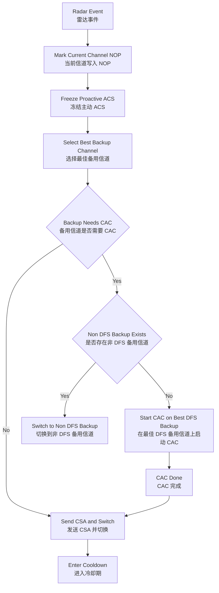

#### 12.4.1 流程图说明

1. 这张图只处理 DFS 雷达应急，不处理普通主动优化。
2. 一旦收到雷达事件，当前信道立即失效，系统先保证合规，再考虑性能。
3. 若存在合法非 DFS 备用信道，则优先直接切过去。
4. 只有没有可用非 DFS 备用信道时，才在 DFS 备用信道上执行 `CAC` 后再切换。

## 13. 程序状态机设计

### 13.1 状态定义

1. `ACS_INIT`（初始化）
2. `ACS_MONITOR`（监控）
3. `ACS_CUR_CH_EVAL`（当前信道评估）
4. `ACS_TRIGGER_SCAN`（触发扫描）
5. `ACS_FULL_EVALUATE`（全量评估）
6. `ACS_WAIT_SAFE_WINDOW`（等待安全窗口）
7. `ACS_PREPARE_SWITCH`（准备切换）
8. `ACS_IN_CAC`（执行 CAC）
9. `ACS_APPLY_SWITCH`（应用切换）
10. `ACS_COOLDOWN`（冷却）
11. `ACS_DFS_EMERGENCY`（DFS 应急）

### 13.2 状态机流程图

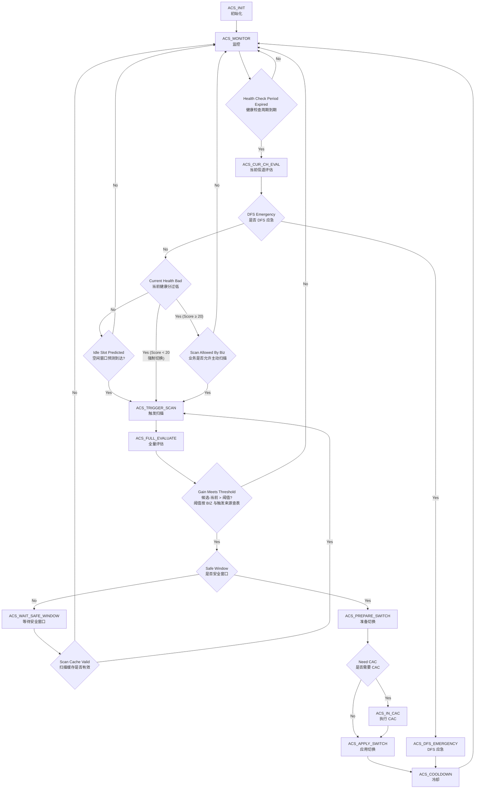

#### 13.2.1 流程图说明

1. `ACS_MONITOR -> ACS_CUR_CH_EVAL` 是常规周期主路径。
2. 健康分过低（Score ≥ 20）时进入被动扫描路径，健康分达标但 Business Analyzer 预测空闲窗口到达时进入主动扫描路径，两者在 `ACS_TRIGGER_SCAN` 汇合，后续全量评估→决策→切换流程完全一致。HealthScore < 20 时走强制切换分支，绕过 BIZ 门控（H 节点），直接进入 `ACS_TRIGGER_SCAN`。
3. `ACS_WAIT_SAFE_WINDOW` 表示候选更优，但当前时机不适合切换。安全窗口等待超时策略按入口区分：被动入口 5 分钟降级，主动入口 2 小时放弃。等待期间若扫描缓存有效则直接回到 `ACS_TRIGGER_SCAN` 复用缓存结果进入 `ACS_FULL_EVALUATE`（不重新扫描）；缓存过期则回到 `ACS_MONITOR` 重新开始守门。
4. `ACS_DFS_EMERGENCY` 是抢占式状态，优先级高于普通主动优化。
5. 主动入口（P1→Yes）与被动入口（G→Yes(Score≥20)→H→Yes）的 BIZ 门控和切换阈值区别：(a) 主动入口下 J 节点仅 IDLE/WEB/BULK 放行，被动入口下按 §9.7 业务策略表决定；(b) 切换阈值(K)在主动入口下使用更高的主动优化阈值（12~18），被动入口使用较低的逃生阈值（8~14）。强制切换（G→Yes(Score<20)→I）绕过 BIZ 门控，切换阈值统一降为 8。

## 14. 模块详细设计

### 14.1 当前信道监控模块

#### 14.1.1 模块流程图

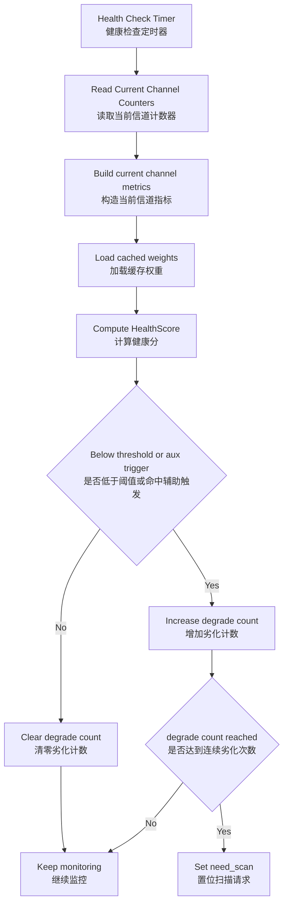

#### 14.1.2 图说明

1. 这张图只负责判断“当前信道是不是已经坏到需要扫描”。
2. 它不比较候选信道，只做守门。
3. 只有连续多次劣化后，才会置位 `need_scan`。

#### 输入

1. `health_check_period` 定时器
2. 驱动当前信道计数器
3. 当前业务状态

#### 输出

1. `channel_metrics_t current_ch_metrics`
2. `S_cur`
3. `need_scan` 标志

#### 功能

1. 周期采样当前信道指标
2. 低开销健康度评分
3. 劣化触发判断
4. 生成按需扫描请求

#### 监控策略

1. 默认不离开当前工作信道
2. 只读取驱动已有计数器和链路统计
3. 连续多次劣化后再触发扫描，避免瞬时抖动

### 14.2 扫描管理模块

#### 14.2.1 模块流程图

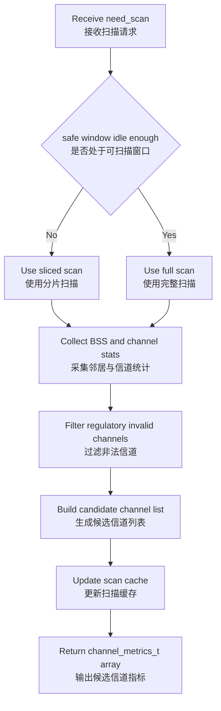

#### 14.2.2 图说明

1. 这张图只负责获取候选信道数据。
2. 忙时走分片扫描，空闲时走完整扫描，目标是降低对业务的打扰。
3. 扫描结果会进入缓存，供等待安全窗口时复用。
4. 被动入口和主动入口共用此模块，处理逻辑完全一致。

#### 输入

1. `need_scan` 事件
2. 空闲窗口通知
3. 驱动扫描接口

#### 输出

1. `channel_metrics_t[]`
2. 扫描时间戳
3. 候选信道缓存

#### 功能

1. 按需全信道扫描
2. 空闲窗口加速扫描
3. DFS 缓存结果更新
4. 邻居 BSS 聚合
5. 为 `ACS_WAIT_SAFE_WINDOW` 提供短时复用的候选缓存

#### 扫描策略

1. 当前信道健康度达标时，不做全信道扫描（被动入口不触发，主动入口定时触发）
2. 忙时使用分片扫描，每次离信道停留 `30 ms`
3. 空闲时使用完整扫描
4. Mesh 从节点与主节点错峰扫描
5. 扫描结果缓存有效期固定为 `scan_cache_ttl`

### 14.3 业务分析模块

#### 14.3.1 模块流程图

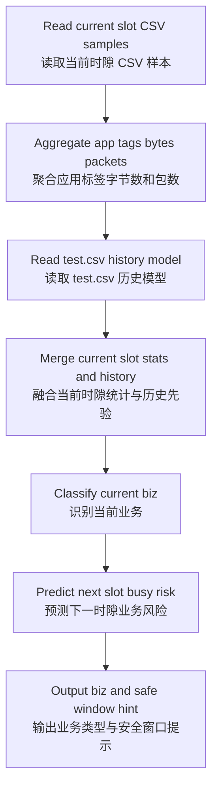

#### 14.3.2 图说明

1. 这张图只处理业务识别和时段预测。
2. 当前业务来自 flow classify CSV，历史忙闲规律来自 `test.csv` 学习结果。
3. 输出结果只提供业务侧安全窗口提示，最终 `safe_window` 还要叠加 `switch_guard_t` 运行时保护条件。

#### 输入

1. 当前时段 `test.csv` 样本
2. `test.csv` 历史数据
3. 业务标签映射表
4. 游戏与语音识别策略表

#### 输出

1. `biz_profile_t biz_profile`（业务画像）
2. `uint8_t next_slot_busy_risk`（下一时隙繁忙风险，可选后台输出）

#### 功能

1. CSV 业务样本聚合
2. 历史时隙学习
3. 漂移检测
4. 下一时隙繁忙风险预测

### 14.4 评分引擎

#### 14.4.1 模块流程图

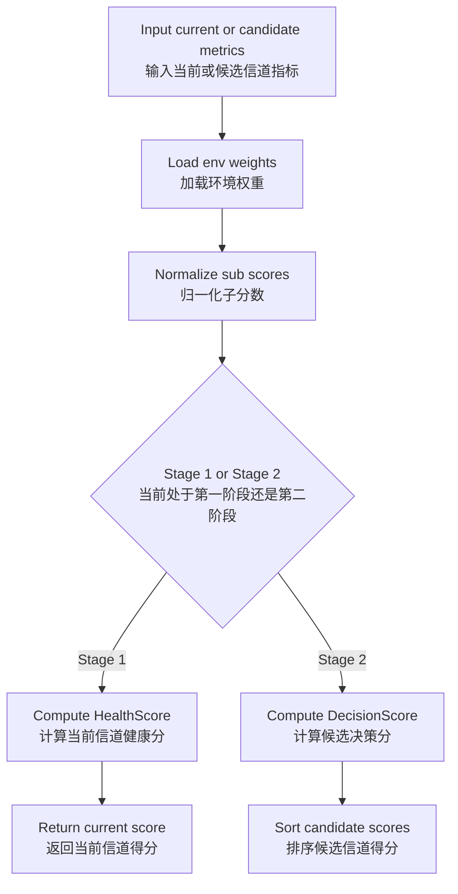

#### 14.4.2 图说明

1. 这张图说明评分引擎分成两个阶段。
2. 第一阶段只算当前信道健康分，第二阶段才算候选决策分。
3. 评分前先加载环境权重；第二阶段额外读取 `switch_guard_t` 计算切换代价。

#### 输入

1. 当前信道指标或候选信道指标
2. 环境权重
3. `switch_guard_t` 切换保护画像
4. DFS 限制
5. Mesh 协同约束

#### 输出

1. 当前信道健康度分数
2. 候选信道得分排序

#### 功能

1. 当前信道单点评分
2. 归一化
3. 子分数计算
4. 最终加权评分
5. 排序与候选截断

### 14.5 决策控制器

#### 14.5.1 模块流程图

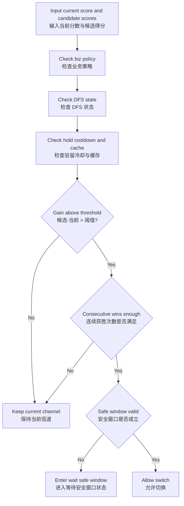

#### 14.5.2 图说明

1. 这张图回答的不是“哪个信道分高”，而是“现在能不能切”。
2. 收益够大还不够，还要同时满足业务策略、DFS 状态、冷却时间和安全窗口。
3. 不满足时进入保持状态或等待安全窗口状态。

#### 输入

1. 当前信道分数
2. 候选排序结果
3. 当前业务
4. 安全窗口状态
5. 驻留和冷却状态
6. DFS 状态与扫描缓存状态

#### 输出

1. `switch_decision_t`
2. `target_channel`

#### 功能

1. 收益判定（被动入口与主动入口使用不同阈值）
2. 连续获胜计数
3. 驻留、冷却、DFS 和缓存前置条件校验
4. 安全窗口等待态管理
5. DFS 应急优先级抢占

### 14.6 环境分类模块

#### 输入

1. 扫描结果
2. `env_input_t`
3. Mesh 拓扑信息

#### 输出

1. `env_profile_t`
2. `acs_weight_t`

#### 功能

1. 识别主问题环境
2. 识别次问题标签
3. 计算严重度
4. 生成基础权重与修正权重

#### 14.6.1 模块流程图

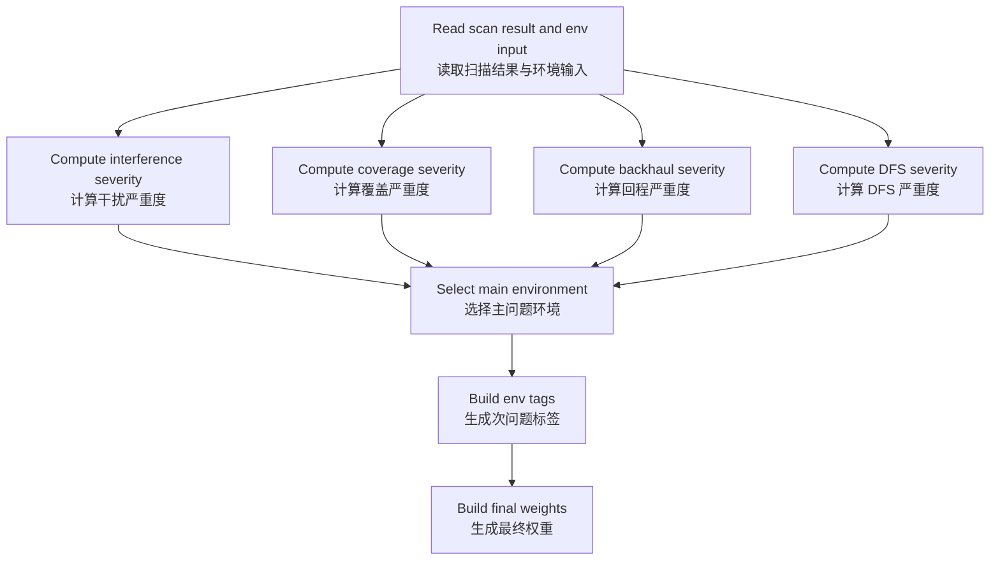

#### 14.6.2 图说明

1. 这张图的核心是“先识别主问题，再生成权重”。
2. 干扰、覆盖、回程、DFS 会分别计算严重度。
3. 最终输出的是主问题环境、次问题标签和对应权重。

### 14.7 DFS 管理模块

#### 输入

1. 雷达事件
2. 监管域限制
3. 候选信道池

#### 输出

1. DFS 可用性状态
2. NOP 黑名单
3. 应急切换建议

#### 功能

1. 维护 `NOP`
2. 维护 `CAC`
3. 处理雷达应急
4. 输出 DFS 约束

#### 14.7.1 模块流程图

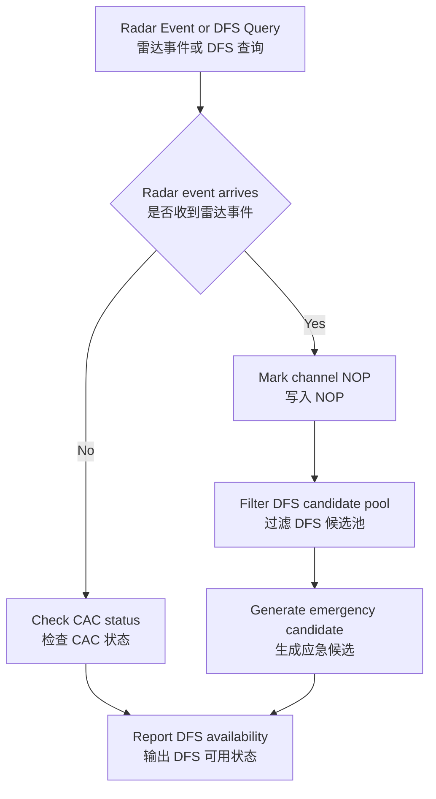

#### 14.7.2 图说明

1. 这张图既支持应急雷达事件，也支持普通 DFS 状态查询。
2. 雷达事件路径用于紧急避让。
3. 查询路径用于告诉评分和决策模块哪些 DFS 信道当前可用。

### 14.8 Mesh 协调模块

#### 输入

1. 多 AP 候选信道
2. 回程质量
3. AP 邻接关系

#### 输出

1. 多 AP 协同信道方案
2. 回程保护约束

#### 功能

1. 避免前传与回程互相挤压
2. 避免重叠覆盖区域同频冲突
3. 输出网络级最优组合

#### 14.8.1 模块流程图

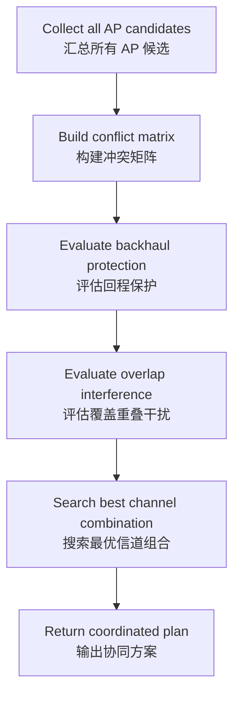

#### 14.8.2 图说明

1. 这张图不是给单 AP 选信道，而是给整个 Mesh 网络选组合。
2. 它同时考虑回程保护和覆盖重叠冲突。
3. 输出结果是多 AP 的协同方案，不是单个候选信道。

### 14.9 学习引擎模块

#### 输入

1. `test.csv`
2. 当前时隙 `test.csv` 增量样本
3. 当前时隙编号

#### 输出

1. 时隙业务概率
2. 业务漂移结果
3. 业务安全窗口预测结果

#### 功能

1. 导入历史业务样本
2. 更新时隙概率
3. 检测业务模式漂移
4. 预测繁忙与空闲时段

#### 14.9.1 模块流程图

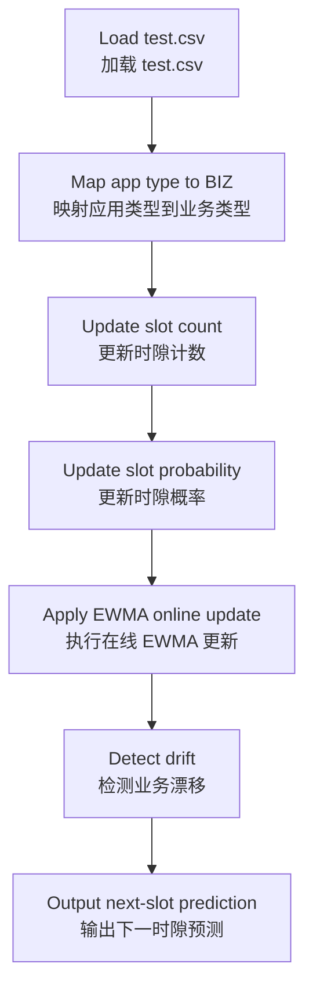

#### 14.9.2 图说明

1. 这张图只处理学习，不直接做切换决策。
2. 它把历史业务样本和当前时隙 `test.csv` 增量样本转成时隙概率，再做 EWMA 更新。
3. 输出结果用于预测哪些时间段更适合扫描或切换。

### 14.10 信道切换执行模块

#### 输入

1. 目标信道
2. `switch_decision_t`
3. DFS 与 Mesh 约束

#### 输出

1. 实际切换结果
2. 状态缓存更新
3. 冷却期状态

#### 功能

1. 执行 `CSA`
2. 处理 `CAC`
3. 更新当前信道状态
4. 触发 Mesh 同步

#### 14.10.1 模块流程图

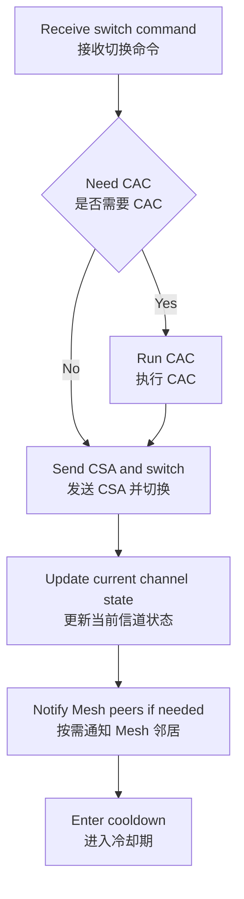

#### 14.10.2 图说明

1. 这张图只负责执行，不重新做策略判断。
2. 若目标信道需要 `CAC`，则先做 `CAC` 再切换。
3. 切换完成后立即更新状态并进入冷却期。

## 15. 核心数据结构设计

```c
typedef enum {
    BIZ_IDLE = 0,
    BIZ_WEB,
    BIZ_VIDEO,
    BIZ_CALL,
    BIZ_GAME,
    BIZ_BULK,
    BIZ_MAX
} biz_type_t;

typedef enum {
    ENV_BALANCED = 0,
    ENV_INTERFERENCE_HEAVY,
    ENV_WEAK_COVERAGE,
    ENV_BACKHAUL_CONSTRAINED,
    ENV_DFS_SENSITIVE
} env_type_t;

typedef enum {
    TAG_INTERFERENCE = 0x01,
    TAG_COVERAGE     = 0x02,
    TAG_BACKHAUL     = 0x04,
    TAG_DFS          = 0x08,
    TAG_STABILITY_RISK = 0x10
} env_tag_t;

typedef struct {
    uint8_t severity_interference;    /* 干扰问题严重度 */
    uint8_t severity_coverage;        /* 覆盖问题严重度 */
    uint8_t severity_backhaul;        /* 回程问题严重度 */
    uint8_t severity_dfs;             /* DFS 问题严重度 */
    uint8_t severity_balanced;        /* 均衡状态严重度 */
    uint8_t env_tags;                 /* 次问题标签位图 */
    env_type_t main_env;              /* 主问题环境类型 */
} env_profile_t;

typedef struct {
    uint8_t mesh_ap_cnt;              /* Mesh AP 数量 */
    uint8_t has_wireless_backhaul;    /* 是否存在无线回程 */
    int8_t  cur_snr_db;               /* 当前主服务链路信噪比 */
    uint8_t coverage_edge_sta_ratio;  /* 边缘站点占比 */
    int8_t  backhaul_rssi_avg;        /* 回程链路平均 RSSI */
    uint8_t backhaul_busy_pct;        /* 回程链路忙时比 */
    uint8_t backhaul_retry_pct;       /* 回程链路重传率 */
    uint8_t dfs_radar_evt_7d;         /* 7 天内 DFS 雷达事件次数 */
    uint8_t dfs_cac_fail_cnt_7d;      /* 7 天内 DFS CAC 失败次数 */
    uint8_t score_variance;           /* 信道评分波动度 */
    uint8_t history_good_ratio;       /* 历史良好占比 */
} env_input_t;

typedef struct {
    uint8_t  channel;
    uint16_t freq_mhz;
    uint8_t  bandwidth_mhz;
    int8_t   noise_floor_dbm;
    uint8_t  busy_pct;
    uint8_t  retry_pct;
    uint8_t  cca_fail_pct;
    uint8_t  foreign_bss_cnt;
    uint8_t  strong_bss_cnt;
    uint16_t cci_load;
    uint16_t aci_load;
    uint8_t  dfs_required;
    uint8_t  dfs_available;
    uint8_t  radar_hits_7d;
    uint8_t  history_good_ratio;      /* 历史良好占比 */
    uint8_t  score_variance;          /* 信道评分波动度 */
    uint8_t  backhaul_phy_score;
    uint8_t  backhaul_airtime_score;
    uint8_t  client_bw_match_score;
    uint8_t  client_nss_match_score;
} channel_metrics_t;

typedef struct {
    float w_busy;
    float w_cci;
    float w_aci;
    float w_noise;
    float w_rate;
    float w_stability;
    float w_mesh;
    float w_dfs;
    float w_switch_cost;
} acs_weight_t;

typedef enum {
    ACS_DECISION_KEEP = 0,
    ACS_DECISION_WAIT_SAFE_WINDOW,
    ACS_DECISION_SWITCH
} switch_decision_t;

typedef struct {
    uint8_t current_slot;
    uint16_t sample_cnt;
    uint8_t light_sample_ratio;
    uint8_t bulk_sample_ratio;
    uint8_t voice_rule_hit;
    uint8_t game_rule_hit;
    biz_type_t current_biz;
} biz_profile_t;

typedef struct {
    uint8_t active_sta_cnt;
    uint8_t txq_util_pct;
    uint8_t cpu_util_pct;
    uint8_t mem_pressure_low;
    uint8_t recent_ux_bad;
} switch_guard_t;

typedef struct {
    uint8_t current_slot;
    uint16_t sample_cnt;
    uint16_t light_sample_cnt;
    uint16_t bulk_sample_cnt;
    uint16_t voice_sample_cnt;
    uint16_t game_sample_cnt;
    uint16_t app_type_cnt[16];
} csv_biz_sample_t;

typedef struct {
    float slot_prob[96][BIZ_MAX];       /* EWMA 综合概率 (λ=0.85) */
    float slot_prob_short[96][BIZ_MAX]; /* P_short: EWMA 短期概率 (λ=0.70, ∼3天等效窗口) */
    float slot_prob_long[96][BIZ_MAX];  /* P_long: EWMA 长期概率 (λ=0.95, ∼21天等效窗口) */
    uint32_t slot_count[96][BIZ_MAX];   /* 原始累计计数（CSV 导入用） */
    uint8_t  jsd_drift_cnt;             /* JSD 漂移连续天数 (JSD_daily >= 0.18) */
    uint8_t  jsd_rapid_cnt;             /* JSD 快速漂移连续天数 (JSD_daily >= 0.35) */
    uint8_t  drift_active;              /* 当前是否处于重权重阶段 */
    uint8_t  drift_rapid;               /* 当前是否处于快速漂移加速阶段 */
    uint16_t drift_day_remaining;       /* 重权重剩余持续天数 */
} biz_learning_db_t;

typedef struct {
    uint8_t current_channel;
    uint8_t last_switch_channel;
    uint64_t last_switch_ts;
    uint64_t channel_enter_ts;
    uint64_t last_scan_ts;
    uint64_t safe_window_wait_start;   /* 安全窗口等待起始时间戳（0=未等待） */
    uint8_t consecutive_win_cnt;
    uint8_t degrade_cnt;
    uint8_t need_scan;
    uint8_t dfs_emergency;
    uint8_t pending_target_channel;
    uint8_t pending_wait_safe_window;
    uint8_t degraded_switch;           /* 当前切换是否为降级切换（影响冷却时长） */
    uint16_t degraded_switch_cnt;      /* 降级切换累计次数（运维统计用） */
    env_profile_t env_profile;
    acs_weight_t weights;
    biz_learning_db_t learning_db;
} acs_ctx_t;
```

## 16. 接口设计

### 16.1 扫描接口

```c
int acs_scan_channels(channel_metrics_t *out, size_t max_num, size_t *real_num);
```

#### 输入

1. `out`：输出缓存
2. `max_num`：最大信道数

#### 输出

1. `real_num`：实际返回数

### 16.1.1 当前信道采样接口

```c
int acs_get_current_channel_metrics(channel_metrics_t *out);
```

#### 输入

1. `out`：当前信道指标输出缓存

#### 输出

1. 成功返回 `0`
2. 失败返回负错误码

### 16.2 CSV 读取接口

```c
int acs_load_biz_csv(const char *path, biz_learning_db_t *db);
```

#### 输入

1. `path`：固定传入 `test.csv` 路径
2. `db`：学习数据库

#### 输出

1. 成功返回 `0`
2. 失败返回负错误码

### 16.3 业务识别接口

```c
int acs_classify_biz(const csv_biz_sample_t *sample,
                     const biz_learning_db_t *db, biz_profile_t *profile);
```

#### 输出语义

1. `profile->current_biz`：当前时隙 ACS 决策业务类型
2. `profile->light_sample_ratio`：当前时隙轻业务样本占比
3. `profile->bulk_sample_ratio`：当前时隙大流量样本占比
4. `profile->voice_rule_hit`：语音规则命中结果
5. `profile->game_rule_hit`：游戏规则命中结果

### 16.3.1 切换保护采集接口

```c
int acs_collect_switch_guard(switch_guard_t *guard);
```

#### 输出语义

1. `guard->active_sta_cnt`：当前活跃站点数
2. `guard->txq_util_pct`：发送队列利用率
3. `guard->cpu_util_pct`：CPU 利用率
4. `guard->mem_pressure_low`：内存是否处于低压安全状态
5. `guard->recent_ux_bad`：近期是否出现体验恶化事件

### 16.4 环境识别接口

```c
int acs_build_env_profile(const channel_metrics_t *chs, size_t num,
                          const env_input_t *env_in, env_profile_t *profile);
```

#### 输出语义

1. `profile->main_env`：主问题环境
2. `profile->env_tags`：次问题标签位图
3. `profile->severity_*`：各问题严重度

说明：

1. 该接口输出的是整体网络无线问题类型环境，不是部署地点类型
2. 第一阶段直接复用上次整体网络环境识别结果
3. 第二阶段在环境刷新周期到达或事件触发时重新调用该接口
4. `profile->main_env` 直接替代单独的主环境返回接口

### 16.5 评分接口

```c
float acs_score_health(const channel_metrics_t *ch, const acs_weight_t *w);
float acs_score_decision(const channel_metrics_t *ch, const acs_weight_t *w,
                         const biz_profile_t *bp, const switch_guard_t *guard,
                         uint8_t current_channel);
```

### 16.5.1 当前信道守门接口

```c
int acs_should_scan(acs_ctx_t *ctx, const channel_metrics_t *cur_ch,
                    const biz_profile_t *bp, const switch_guard_t *guard,
                    const env_input_t *env_in, uint8_t safe_window,
                    float *cur_score);
```

#### 输出语义

1. 返回 `1`：当前信道质量不达标，需要进入第二阶段扫描
2. 返回 `0`：当前信道质量达标，本周期结束
3. `cur_score`：当前信道健康度分数

### 16.6 决策接口

```c
switch_decision_t acs_make_decision(acs_ctx_t *ctx, const channel_metrics_t *cur_ch,
                                    const channel_metrics_t *chs, size_t num,
                                    const biz_profile_t *bp,
                                    const switch_guard_t *guard,
                                    uint8_t safe_window, uint64_t now_ts,
                                    uint8_t *target_channel);
```

#### 输出语义

1. `ACS_DECISION_KEEP`：保持当前信道
2. `ACS_DECISION_WAIT_SAFE_WINDOW`：候选收益满足条件，但当前不处于安全窗口，进入等待状态
3. `ACS_DECISION_SWITCH`：允许切换到 `target_channel`

## 17. 关键算法流程

### 17.1 启动初始化流程图

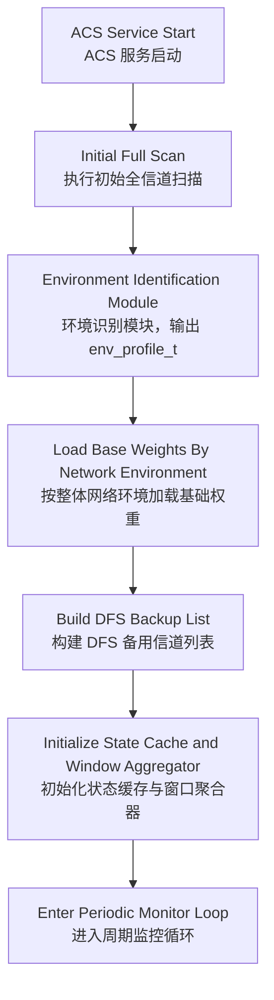

#### 17.1.1 图说明

1. 这张图描述的是整个程序启动后的初始化主链路。
2. 系统启动时必须先做一次全信道扫描，不能直接进入评分。
3. 初始扫描完成后先识别整体网络环境并输出 `env_profile_t`，再按整体网络环境加载基础权重。
4. 启动阶段输出的是 `INIT_FAST` 初始环境，不等待 10 分钟窗口走满。
5. 只有初始化状态、DFS 备用列表、环境权重和窗口聚合器都准备完成后，系统才进入周期守门阶段。

### 17.2 算法运行总流程图

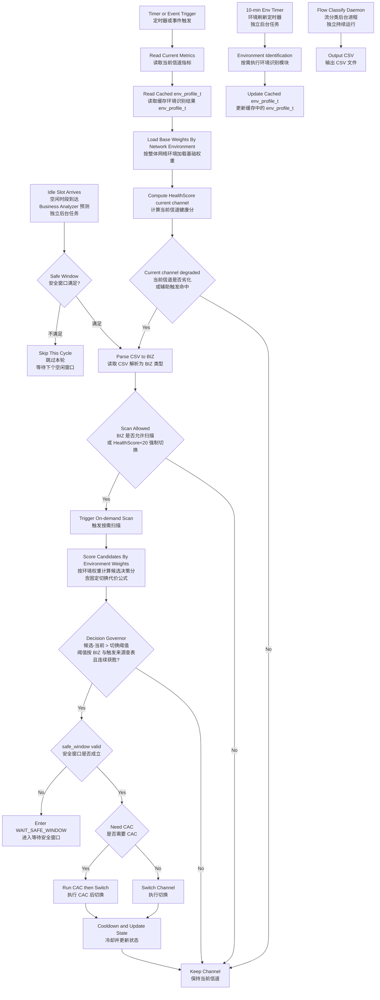

#### 17.2.1 图说明

1. 这张图是整套 ACS 的总算法主链路。
2. 这张图描述的是初始化完成后的运行时主链路，不是上电初始化流程。
3. 左半部分先显式执行"读取缓存环境识别结果 `env_profile_t` -> 按环境加载基础权重"，然后计算当前信道健康分并做劣化判定。此阶段不读取业务类型，仅依赖环境权重和信道指标。
4. 业务识别（P1 节点）仅在健康分不达标（H→Yes）或主动优化入口（T3→TA→Yes）时触发，主流程读取 CSV 并解析为 6 类 BIZ 类型，用于扫描门控(J)和切换阈值(O)。业务不参与评分权重生成。
5. 中间部分只有在"当前信道已劣化且业务允许扫描"（或 HealthScore<20 强制切换）时才会进入；进入后直接扫描候选信道，复用第一阶段已加载的环境权重计算候选决策分，不重新加载权重。
6. 切换完成后只更新当前信道状态，不立即重识别整体网络环境。
7. 整体网络环境由后台 10 分钟定时器独立刷新，不嵌入主决策链路。
8. 底部 T2（Flow Classify Daemon）和 T3（空闲时段到达）是独立后台路径。T2 只持续产出 CSV 文件；T3 是 Business Analyzer 预测空闲窗口后触发的主动优化入口，汇入 P1 后与被动路径共享后续流水线。
9. 它强调的核心顺序是：先环境（启动时首次识别并缓存，后续每 10 分钟后台刷新），后权重（从缓存加载，主链路只加载一次），再评分（Stage 1/2 复用同一权重），最后决策。业务仅在劣化后才参与门控与阈值判断。

### 17.3 周期优化流程

```text
1. 定时器触发
2. 读取当前信道指标
3. 复用缓存环境识别结果 `env_profile_t`
4. 按缓存环境加载本周期基础权重
5. 计算当前信道健康分 `HealthScore`
6. 判断健康分是否达标、辅助劣化条件是否触发，以及是否达到连续 3 次劣化
7. 若未达到扫描触发条件，则结束本周期
8. 若达到扫描触发条件，读取 flow classify CSV 解析当前业务
9. 根据当前业务确定扫描许可与切换阈值
10. 若当前业务不允许主动扫描（且 HealthScore>=20），则结束本周期
11. 采集 `switch_guard_t` 运行时切换保护画像
12. 计算 `safe_window`
13. 触发全信道扫描
14. 复用第一阶段已加载的环境权重，计算候选决策分 `DecisionScore`
15. 计算当前信道决策分
16. 判断候选得分 - 当前得分是否超过切换阈值
17. 判断是否满足连续获胜次数
18. 判断驻留、冷却、DFS 和候选缓存前置条件
19. 判断是否处于安全窗口
20. 满足则切换，不满足则等待
21. 切换完成后只更新当前信道状态和冷却计时

> **后台独立任务**：环境刷新定时器每 10 分钟触发一次，通过滑动窗口聚合最近 10 分钟的扫描与链路指标，重新执行环境识别并更新缓存中的 `env_profile_t`，不嵌入上述主流程。
```

### 17.4 DFS 应急流程

```text
1. 接收雷达事件
2. 当前信道写入 NOP
3. 从备用池选择合法最佳信道
4. 若无需 CAC 直接切换
5. 若需要 CAC 且没有非 DFS 备用信道，执行 CAC
6. Mesh 场景通知所有相关 AP 协同重排
7. 进入冷却状态
```

### 17.5 两阶段决策伪代码

```text
1. cur_metrics = get_current_channel_metrics()
2. env_base = load_cached_env_base_weights()
3. cur_health = score_health(cur_metrics, env_base)
4. if cur_health >= bad_score_enter and no auxiliary trigger:
5.     return KEEP_CHANNEL
6. if degrade_cnt < 3:
7.     return KEEP_CHANNEL
8. csv_sample = build_current_slot_csv_sample()
9. biz_profile = classify_biz(csv_sample, learning_db)
10. if biz_profile blocks proactive scan and cur_health >= 20:
11.     return KEEP_CHANNEL
12. guard = collect_switch_guard()
13. safe_window = check_safe_window(biz_profile, guard)
14. scan all candidate channels
15. cur_decision = score_decision(cur_metrics, env_base, biz_profile, guard, current_channel)
16. best = score_all_candidates(scan_result, env_base, biz_profile, guard, current_channel)
17. if best.score - cur_decision < gain_enter:
18.     return KEEP_CHANNEL
19. if win_cnt < required_wins:
20.     return KEEP_CHANNEL
21. if dfs_emergency or not hold_ok or not cooldown_ok:
22.     return KEEP_CHANNEL
23. if scan_cache_age > scan_cache_ttl:
24.     return KEEP_CHANNEL
25. if not safe_window:
26.     cache(best.channel)
27.     return WAIT_SAFE_WINDOW
28. return SWITCH_TO(best.channel)
```

> **后台独立任务**（每 10 分钟触发，不嵌入上述主流程）：
>
> ```text
> 1. if env_refresh_timer_expired():
> 2.     env_profile = build_env_profile(scan_result, env_input)
> 3.     env_base = build_env_base_weights(env_profile)
> 4.     update_cached_env(env_profile, env_base)
> ```

## 18. 关键 C 代码

### 18.1 CSV 读取实现

```c
#include <stdio.h>
#include <stdlib.h>
#include <string.h>
#include <time.h>

static int parse_slot_index_ms(const char *ts_ms)
{
    long long ms;
    time_t sec;
    struct tm local_tm;
    char *endptr = NULL;

    if (ts_ms == NULL) {
        return -1;
    }

    ms = strtoll(ts_ms, &endptr, 10);
    if (endptr == ts_ms || *endptr != '\0' || ms <= 0) {
        return -1;
    }

    sec = (time_t)(ms / 1000);
    if (localtime_r(&sec, &local_tm) == NULL) {
        return -1;
    }

    return local_tm.tm_hour * 4 + local_tm.tm_min / 15;
}

static biz_type_t map_traffic_to_biz(const char *traffic, unsigned long total_bytes,
                                     unsigned long total_packets)
{
    /* 优先级 1: 轻业务样本 → IDLE（仅限单条记录判定；时隙级 IDLE 在 acs_classify_biz 中通过 80% 占比阈值聚合） */
    if (total_bytes < 32UL * 1024UL && total_packets < 32UL) {
        return BIZ_IDLE;
    }
    /* 优先级 2: 视频/音乐 → VIDEO（必须在大流量判定之前，避免大流量视频误判为 BULK） */
    if (traffic && strcmp(traffic, "video") == 0) return BIZ_VIDEO;
    if (traffic && strcmp(traffic, "music") == 0) return BIZ_VIDEO;
    /* 优先级 3: 游戏 → GAME（必须在大流量判定之前，避免大流量游戏误判为 BULK） */
    if (traffic && strcmp(traffic, "game") == 0)  return BIZ_GAME;
    /* 优先级 4: 大流量阈值提升 → BULK（video/music/game 已被排除） */
    if (total_bytes >= 8UL * 1024UL * 1024UL || total_packets >= 4000UL) {
        return BIZ_BULK;
    }
    /* 优先级 5: 云/存储 → BULK */
    if (traffic && strcmp(traffic, "cloud") == 0) return BIZ_BULK;
    if (traffic && strcmp(traffic, "storage") == 0) return BIZ_BULK;
    /* 优先级 6: 其余 → WEB（含 communication，语音/游戏二次提升由 acs_classify_biz 处理） */
    return BIZ_WEB;
}

int acs_load_biz_csv(const char *path, biz_learning_db_t *db)
{
    FILE *fp;
    char line[512];

    if (path == NULL || db == NULL) {
        return -1;
    }

    fp = fopen(path, "r");
    if (fp == NULL) {
        return -2;
    }

    if (fgets(line, sizeof(line), fp) == NULL) {
        fclose(fp);
        return -3;
    }

    while (fgets(line, sizeof(line), fp) != NULL) {
        char *saveptr = NULL;
        char *ts = strtok_r(line, ",", &saveptr);
        char *token = NULL;
        char *traffic = NULL;
        char *total_bytes_s = NULL;
        char *total_packets_s = NULL;
        int slot;
        biz_type_t type;
        uint32_t total = 0;
        int i;
        int col = 1;
        unsigned long total_bytes = 0;
        unsigned long total_packets = 0;

        if (ts == NULL) {
            continue;
        }

        while ((token = strtok_r(NULL, ",", &saveptr)) != NULL) {
            col++;
            if (col == 14) traffic = token;
            else if (col == 15) total_bytes_s = token;
            else if (col == 16) total_packets_s = token;
        }

        if (traffic == NULL || total_bytes_s == NULL || total_packets_s == NULL) {
            continue;
        }

        slot = parse_slot_index_ms(ts);
        if (slot < 0 || slot >= 96) {
            continue;
        }

        total_bytes = strtoul(total_bytes_s, NULL, 10);
        total_packets = strtoul(total_packets_s, NULL, 10);
        type = map_traffic_to_biz(traffic, total_bytes, total_packets);
        db->slot_count[slot][type]++;

        for (i = 0; i < BIZ_MAX; i++) {
            total += db->slot_count[slot][i];
        }

        if (total == 0) {
            continue;
        }

        for (i = 0; i < BIZ_MAX; i++) {
            db->slot_prob[slot][i] =
                (float)db->slot_count[slot][i] / (float)total;
        }
    }

    fclose(fp);
    return 0;
}
```

### 18.2 CSV 代码说明

1. `parse_slot_index_ms` 将 `test.csv` 的毫秒时间戳映射到 96 个 15 分钟时隙
2. `map_traffic_to_biz` 将上游 `app_type` 标签和流量规模映射为 `BIZ_*`
3. `acs_load_biz_csv` 逐行读取 `test.csv`
4. 每读取一条记录，即更新该时隙下相应业务计数
5. 更新后立即重算该时隙业务概率
6. 该实现不依赖第三方库，适合固件环境

### 18.3 健康分与决策分实现

```c
static float clampf(float v, float lo, float hi)
{
    if (v < lo) return lo;
    if (v > hi) return hi;
    return v;
}

static float score_neg(float x, float lo, float hi)
{
    return clampf(100.0f * (hi - x) / (hi - lo), 0.0f, 100.0f);
}

static float score_pos(float x, float lo, float hi)
{
    return clampf(100.0f * (x - lo) / (hi - lo), 0.0f, 100.0f);
}

static float acs_score_core(const channel_metrics_t *ch, const acs_weight_t *w,
                            float s_switch_cost)
{
    float s_busy = score_neg((float)ch->busy_pct, 10.0f, 90.0f);
    float s_cci  = score_neg((float)ch->cci_load, 5.0f, 80.0f);
    float s_aci  = score_neg((float)ch->aci_load, 2.0f, 60.0f);
    float s_noise = score_neg((float)ch->noise_floor_dbm, -105.0f, -85.0f);
    float bw_score = (float)ch->bandwidth_mhz;
    float nss_score = (float)ch->client_nss_match_score;
    float mcs_margin = score_pos(30.0f - (float)ch->retry_pct, 5.0f, 30.0f);
    float retry_factor = 1.0f - ((float)ch->retry_pct / 100.0f);
    float s_rate;
    float s_stability;
    float s_mesh;
    float s_dfs;

    if (bw_score >= 160) bw_score = 100;
    else if (bw_score >= 80) bw_score = 80;
    else if (bw_score >= 40) bw_score = 50;
    else bw_score = 25;

    s_rate = (0.6f * bw_score + 0.2f * nss_score + 0.2f * mcs_margin) * retry_factor;
    s_stability = 0.5f * (float)ch->history_good_ratio
                + 0.3f * (100.0f - (float)(ch->radar_hits_7d * 20))
                + 0.2f * (100.0f - (float)ch->score_variance);

    s_mesh = 100.0f - (100.0f - (float)ch->backhaul_phy_score) * 0.5f
                    - (100.0f - (float)ch->backhaul_airtime_score) * 0.5f;

    s_dfs = ch->dfs_required ?
            (ch->dfs_available ? 85.0f - ch->radar_hits_7d * 15.0f : 0.0f) :
            100.0f;

    return
        w->w_busy        * s_busy +
        w->w_cci         * s_cci +
        w->w_aci         * s_aci +
        w->w_noise       * s_noise +
        w->w_rate        * s_rate +
        w->w_stability   * s_stability +
        w->w_mesh        * s_mesh +
        w->w_dfs         * s_dfs +
        w->w_switch_cost * s_switch_cost;
}

float acs_score_health(const channel_metrics_t *ch, const acs_weight_t *w)
{
    float score = acs_score_core(ch, w, 0.0f);
    float denom = 1.0f - w->w_switch_cost;

    /* 保护：分母过小时（w_switch_cost 接近 1.0 的极端配置）使用原始分数 */
    if (denom <= 0.01f) {
        return score;
    }

    return score / denom;
}

float acs_score_decision(const channel_metrics_t *ch, const acs_weight_t *w,
                         const biz_profile_t *bp, const switch_guard_t *guard,
                         uint8_t current_channel)
{
    biz_type_t biz = BIZ_WEB;
    float realtime_penalty = 0.0f;
    float video_penalty = 0.0f;
    float sta_penalty = 0.0f;
    float s_switch_cost;

    if (bp != NULL) {
        biz = bp->current_biz;
    }

    if (biz == BIZ_CALL || biz == BIZ_GAME) {
        realtime_penalty = 100.0f;
    }
    if (biz == BIZ_VIDEO) {
        video_penalty = 70.0f;
    }

    if (guard != NULL) {
        sta_penalty = clampf((float)guard->active_sta_cnt * 10.0f, 0.0f, 100.0f);
    }

    if (ch->channel == current_channel) {
        s_switch_cost = 100.0f;
    } else {
        s_switch_cost = 100.0f - (
            0.45f * realtime_penalty +
            0.25f * video_penalty +
            0.30f * sta_penalty
        );
    }

    return acs_score_core(ch, w, s_switch_cost);
}
```

### 18.4 评分代码说明

1. `score_neg` 与 `score_pos` 对不同方向指标统一归一化
2. `acs_score_health` 只用于判断当前信道是否恶化
3. `acs_score_decision` 才包含切换代价，专门用于候选比较
4. `Mesh` 重排和切换冷却不进入评分项，而由环境权重与决策前置条件控制
5. `s_stability` 直接将历史稳定性纳入总分，避免纯瞬时最优
6. 当前信道与候选信道的切换代价只在第二阶段生效
7. `biz_profile_t` 只提供业务类型，`switch_guard_t` 只提供切换保护负载，两者职责完全分离

### 18.5 当前信道守门实现

```c
#define BAD_SCORE_ENTER 65.0f

int acs_should_scan(acs_ctx_t *ctx, const channel_metrics_t *cur_ch,
                    const biz_profile_t *bp, const switch_guard_t *guard,
                    const env_input_t *env_in, uint8_t safe_window,
                    float *cur_score)
{
    float score;
    uint8_t aux_bad = 0;
    uint8_t forced_switch = 0;

    if (ctx == NULL || cur_ch == NULL || bp == NULL || guard == NULL ||
        env_in == NULL || cur_score == NULL) {
        return 0;
    }

    /* 强制切换：HealthScore < 20 时忽略业务门控 */
    score = acs_score_health(cur_ch, &ctx->weights);
    *cur_score = score;
    forced_switch = (score < 20.0f);

    if (!forced_switch) {
        if (bp->current_biz == BIZ_CALL || bp->current_biz == BIZ_GAME) {
            ctx->need_scan = 0;
            return 0;
        }
        if (bp->current_biz == BIZ_VIDEO && safe_window == 0) {
            ctx->need_scan = 0;
            return 0;
        }
    }

    if (guard->txq_util_pct >= 20 ||
        guard->cpu_util_pct >= 85 ||
        guard->mem_pressure_low == 0) {
        ctx->need_scan = 0;
        return 0;
    }

    if (cur_ch->busy_pct >= 65 ||
        cur_ch->retry_pct >= 18 ||
        cur_ch->cca_fail_pct >= 20 ||
        cur_ch->noise_floor_dbm >= -88 ||
        guard->recent_ux_bad ||
        (env_in->mesh_ap_cnt >= 2 &&
         (env_in->backhaul_busy_pct >= 45 || env_in->backhaul_retry_pct >= 10)) ||
        env_in->score_variance >= 25 ||
        env_in->history_good_ratio <= 70) {
        aux_bad = 1;
    }

    if (score < BAD_SCORE_ENTER || aux_bad) {
        ctx->degrade_cnt++;
    } else {
        ctx->degrade_cnt = 0;
    }

    if (ctx->degrade_cnt >= 3) {
        ctx->need_scan = 1;
        return 1;
    }

    ctx->need_scan = 0;
    return 0;
}
```

### 18.6 守门代码说明

1. 周期任务只对当前信道调用一次 `acs_score_health`
2. `acs_should_scan` 是第一阶段守门逻辑
3. 通话和游戏场景禁止主动扫描
4. 视频场景只有在安全窗口内才允许主动扫描
5. `switch_guard_t` 在第一阶段只负责保护扫描动作，不承担业务分类职责
6. `recent_ux_bad` 被当作劣化辅助信号，而不是禁止切换的硬条件
7. 当前信道达标时直接返回，不触发全信道扫描
8. 连续 3 次劣化才触发扫描，避免瞬时抖动
9. `need_scan` 用于驱动第二阶段扫描任务

### 18.7 候选决策实现

```c
typedef enum {
    TRIGGER_PASSIVE = 0,   /* 被动入口：HealthScore 过低触发 */
    TRIGGER_PROACTIVE,     /* 主动入口：空闲时段预测触发 */
    TRIGGER_FORCED         /* 强制切换：HealthScore < 20 */
} trigger_source_t;

static uint8_t acs_get_required_wins(const env_profile_t *profile)
{
    if (profile == NULL) {
        return 3;
    }
    if (profile->main_env == ENV_BACKHAUL_CONSTRAINED) {
        return 5;
    }
    if (profile->main_env == ENV_INTERFERENCE_HEAVY) {
        return 4;
    }
    return 3;
}

/* 被动入口切换阈值（8~14） */
static float acs_get_gain_enter_passive(biz_type_t biz)
{
    switch (biz) {
    case BIZ_IDLE:  return 8.0f;
    case BIZ_VIDEO: return 14.0f;
    case BIZ_BULK:  return 12.0f;
    default:        return 10.0f;  /* BIZ_WEB, 未知 */
    }
}

/* 主动入口切换阈值（12~18），仅 IDLE/WEB/BULK 可调用 */
static float acs_get_gain_enter_proactive(biz_type_t biz)
{
    switch (biz) {
    case BIZ_IDLE:  return 12.0f;
    case BIZ_BULK:  return 18.0f;
    default:        return 14.0f;  /* BIZ_WEB */
    }
}

static float acs_get_gain_enter(biz_type_t biz, trigger_source_t source)
{
    if (source == TRIGGER_PROACTIVE) {
        return acs_get_gain_enter_proactive(biz);
    }
    /* TRIGGER_PASSIVE 与 TRIGGER_FORCED 均使用被动阈值，
       TRIGGER_FORCED 由 acs_should_scan 在调用前已绕过业务门控 */
    return acs_get_gain_enter_passive(biz);
}

static uint8_t acs_hold_satisfied(const acs_ctx_t *ctx, uint64_t now_ts)
{
    return (now_ts - ctx->channel_enter_ts) >= 1800;
}

/* 冷却判定：区分正常冷却与降级冷却 */
static uint8_t acs_cooldown_expired(const acs_ctx_t *ctx, uint64_t now_ts)
{
    uint32_t cooldown = ctx->degraded_switch ? 600 : 3600;
    return (now_ts - ctx->last_switch_ts) >= cooldown;
}

static uint8_t acs_scan_cache_valid(const acs_ctx_t *ctx, uint64_t now_ts)
{
    return (now_ts - ctx->last_scan_ts) <= 120;
}

#define SAFE_WINDOW_WAIT_TIMEOUT  300   /* 被动入口：5 分钟超时 */
#define PROACTIVE_SAFE_WINDOW_TIMEOUT 7200  /* 主动入口：2 小时超时 */

switch_decision_t acs_make_decision(acs_ctx_t *ctx, const channel_metrics_t *cur_ch,
                                    const channel_metrics_t *chs, size_t num,
                                    const biz_profile_t *bp,
                                    const switch_guard_t *guard,
                                    uint8_t safe_window, uint64_t now_ts,
                                    uint8_t *target_channel,
                                    trigger_source_t trigger_source)
{
    float best_score = -1.0f;
    float cur_score = -1.0f;
    uint8_t best_channel = ctx->current_channel;
    size_t i;
    float gain;
    float gain_enter;
    uint8_t required_wins;
    uint32_t safe_window_timeout;

    if (ctx == NULL || cur_ch == NULL || chs == NULL || bp == NULL ||
        guard == NULL || target_channel == NULL) {
        return ACS_DECISION_KEEP;
    }

    if (ctx->need_scan == 0) {
        return ACS_DECISION_KEEP;
    }

    /* 主动入口 BIZ 门控：仅 IDLE/WEB/BULK 允许通过 */
    if (trigger_source == TRIGGER_PROACTIVE) {
        if (bp->current_biz != BIZ_IDLE &&
            bp->current_biz != BIZ_WEB &&
            bp->current_biz != BIZ_BULK) {
            return ACS_DECISION_KEEP;
        }
    }

    /* 被动入口 BIZ 门控：CALL/GAME 禁止（强制切换除外） */
    if (trigger_source != TRIGGER_FORCED) {
        if (bp->current_biz == BIZ_CALL || bp->current_biz == BIZ_GAME) {
            return ACS_DECISION_KEEP;
        }
    }

    if (ctx->dfs_emergency) {
        return ACS_DECISION_KEEP;
    }

    if (!acs_hold_satisfied(ctx, now_ts) || !acs_cooldown_expired(ctx, now_ts)) {
        return ACS_DECISION_KEEP;
    }

    if (!acs_scan_cache_valid(ctx, now_ts)) {
        ctx->need_scan = 0;
        ctx->pending_wait_safe_window = 0;
        ctx->safe_window_wait_start = 0;
        return ACS_DECISION_KEEP;
    }

    cur_score = acs_score_decision(cur_ch, &ctx->weights, bp, guard,
                                   ctx->current_channel);

    for (i = 0; i < num; i++) {
        float score = acs_score_decision(&chs[i], &ctx->weights, bp, guard,
                                         ctx->current_channel);
        if (score > best_score) {
            best_score = score;
            best_channel = chs[i].channel;
        }
    }

    if (best_channel == ctx->current_channel || cur_score < 0.0f) {
        ctx->consecutive_win_cnt = 0;
        return ACS_DECISION_KEEP;
    }

    gain_enter = acs_get_gain_enter(bp->current_biz, trigger_source);
    gain = best_score - cur_score;
    if (gain < gain_enter) {
        ctx->consecutive_win_cnt = 0;
        return ACS_DECISION_KEEP;
    }

    required_wins = acs_get_required_wins(&ctx->env_profile);
    ctx->consecutive_win_cnt++;
    if (ctx->consecutive_win_cnt < required_wins) {
        return ACS_DECISION_KEEP;
    }

    if (safe_window == 0) {
        /* 首次进入等待安全窗口状态，记录起始时间 */
        if (ctx->pending_wait_safe_window == 0) {
            ctx->pending_target_channel = best_channel;
            ctx->pending_wait_safe_window = 1;
            ctx->safe_window_wait_start = now_ts;
            return ACS_DECISION_WAIT_SAFE_WINDOW;
        }

        /* 已在等待安全窗口，检查超时 */
        safe_window_timeout = (trigger_source == TRIGGER_PROACTIVE)
                            ? PROACTIVE_SAFE_WINDOW_TIMEOUT
                            : SAFE_WINDOW_WAIT_TIMEOUT;

        if ((now_ts - ctx->safe_window_wait_start) >= safe_window_timeout) {
            if (trigger_source == TRIGGER_PROACTIVE) {
                /* 主动入口超时：直接放弃，不降级 */
                ctx->pending_wait_safe_window = 0;
                ctx->safe_window_wait_start = 0;
                ctx->consecutive_win_cnt = 0;
                return ACS_DECISION_KEEP;
            }
            /* 被动入口超时：尝试降级判定 */
            if (guard->txq_util_pct < 50 && guard->active_sta_cnt <= 8) {
                /* 降级条件满足：允许切换，使用缩短冷却 */
                ctx->degraded_switch = 1;
                ctx->degraded_switch_cnt++;
                *target_channel = best_channel;
                ctx->consecutive_win_cnt = 0;
                ctx->need_scan = 0;
                ctx->pending_wait_safe_window = 0;
                ctx->safe_window_wait_start = 0;
                return ACS_DECISION_SWITCH;
            }
            /* 降级也不满足，放弃本轮 */
            ctx->pending_wait_safe_window = 0;
            ctx->safe_window_wait_start = 0;
            ctx->consecutive_win_cnt = 0;
            return ACS_DECISION_KEEP;
        }
        /* 未超时，继续等待 */
        return ACS_DECISION_WAIT_SAFE_WINDOW;
    }

    /* safe_window 满足，正常切换 */
    *target_channel = best_channel;
    ctx->consecutive_win_cnt = 0;
    ctx->need_scan = 0;
    ctx->pending_wait_safe_window = 0;
    ctx->safe_window_wait_start = 0;
    ctx->degraded_switch = 0;
    return ACS_DECISION_SWITCH;
}
```

### 18.8 决策代码说明

1. 第二阶段只在 `ctx->need_scan == 1` 时运行
2. `acs_make_decision` 不再承担"是否扫描"的判断职责
3. 当前信道决策分由 `cur_ch` 单独输入，不依赖候选列表必须带当前信道
4. 连续获胜次数按环境动态选择，不再固定为 3
5. `trigger_source` 区分被动/主动/强制三种入口：主动入口仅 IDLE/WEB/BULK 可进入；强制入口绕过 CALL/GAME 门控
6. 切换阈值按 `trigger_source` 与 BIZ 类型联合查表：被动 8~14，主动 12~18
7. `safe_window` 等待超时按入口区分：被动 5 分钟超时后降级（txq<50% / sta≤8），降级成功使用缩短冷却 600s；主动 2 小时超时直接放弃不降级
8. `ACS_WAIT_SAFE_WINDOW` 期间复用最近一次扫描缓存，不做重复扫描
9. 若扫描缓存超时，则清空等待态并回到第一阶段重新守门
10. 降级切换后 `degraded_switch` 标志在下次正常切换成功时清零
5. `safe_window`、最短驻留时间、冷却时间、DFS 状态和扫描缓存统一在第二阶段决策接口中校验
6. `ACS_WAIT_SAFE_WINDOW` 期间复用最近一次扫描缓存，不做重复扫描
7. 若扫描缓存超时，则清空等待态并回到第一阶段重新守门
8. 第一阶段负责发现问题，第二阶段负责比较候选
9. 该拆分后，绝大多数周期不会进入候选遍历
10. 第二阶段不再从运行时保护指标反推业务类型，业务输入固定来自 `biz_profile_t`

### 18.9 在线学习更新实现

```c
void acs_update_slot_learning(biz_learning_db_t *db, int slot, biz_type_t biz)
{
    const float lambda      = 0.85f;  /* 综合分布 */
    const float lambda_short = 0.70f;  /* P_short，约 3 天等效窗口 */
    const float lambda_long  = 0.95f;  /* P_long，约 21 天等效窗口 */
    int i;

    for (i = 0; i < BIZ_MAX; i++) {
        float obs = (i == biz) ? 1.0f : 0.0f;
        db->slot_prob[slot][i]       = lambda      * db->slot_prob[slot][i]       + (1.0f - lambda)      * obs;
        db->slot_prob_short[slot][i] = lambda_short * db->slot_prob_short[slot][i] + (1.0f - lambda_short) * obs;
        db->slot_prob_long[slot][i]  = lambda_long  * db->slot_prob_long[slot][i]  + (1.0f - lambda_long)  * obs;
    }
}
```

### 18.10 在线学习代码说明

1. 每次当前时隙 `test.csv` 增量样本到达时，只更新当前时隙
2. 三个分布（综合 / P_short / P_long）**共用同一个观测源**，以不同 λ 独立更新
3. 新模式会在连续多次观测后快速上升（尤其是 λ=0.70 的 P_short）
4. 旧模式会被指数衰减（λ=0.95 的 P_long 衰减最慢，保留长期记忆）
5. 冷启动时 P_short 和 P_long 的初始值与 `slot_prob` 相同（均由 CSV 导入的频率统计初始化）
6. 无需保存庞大原始日志，适合嵌入式环境

## 19. 参数设计

### 19.1 推荐默认参数

#### 19.1.1 时序与冷却参数

| 参数 | 默认值 | 说明 |
|---|---:|---|
| `min_hold_time` | 1800 秒 | 最短驻留时间 |
| `cooldown_time` | 3600 秒 | 切换冷却时间 |
| `degraded_cooldown_time` | 600 秒 | 安全窗口降级切换后的缩短冷却时间 |
| `scan_cache_ttl` | 120 秒 | 等待安全窗口期间的候选缓存有效期 |
| `health_check_period` | 60 秒 | 当前信道健康度评分周期 |
| `idle_scan_period` | 600 秒 | 空闲态扫描周期 |
| `busy_scan_period` | 1800 秒 | 忙态扫描周期 |
| `proactive_scan_interval_min` | 86400 秒（24h） | 两次主动全扫描最小间隔 |
| `safe_window_wait_timeout` | 300 秒（5min） | 安全窗口等待超时（被动入口） |
| `proactive_safe_window_timeout` | 7200 秒（2h） | 主动入口安全窗口等待超时 |
| `dfs_freeze_timeout` | 1800 秒（30min） | DFS 应急冻结时长 |

#### 19.1.2 评分与阈值参数

| 参数 | 默认值 | 说明 |
|---|---:|---|
| `bad_score_enter` | 65 | 触发扫描的 HealthScore 阈值（不随业务变化） |
| `forced_switch_threshold` | 20 | 强制切换阈值（HealthScore 低于此值忽略业务门控） |
| `gain_enter_idle` | 8 | 空闲态被动切换阈值 |
| `gain_enter_web` | 10 | Web 态被动切换阈值 |
| `gain_enter_video` | 14 | 视频态被动切换阈值 |
| `gain_enter_bulk` | 12 | 大流量被动切换阈值 |
| `proactive_gain_enter_idle` | 12 | 空闲态主动优化阈值 |
| `proactive_gain_enter_web` | 14 | Web 态主动优化阈值 |
| `proactive_gain_enter_bulk` | 18 | 大流量主动优化阈值 |
| `required_wins_balanced` | 3 | 均衡环境或默认环境连续获胜次数 |
| `required_wins_interference` | 4 | 强干扰环境连续获胜次数 |
| `required_wins_backhaul` | 5 | 回程受压环境连续获胜次数 |

#### 19.1.3 辅助触发与门控参数

| 参数 | 默认值 | 说明 |
|---|---:|---|
| `busy_trigger` | 65 | 忙时辅助触发阈值（%） |
| `retry_trigger` | 18 | 重传辅助触发阈值（%） |
| `cca_fail_trigger` | 20 | CCA 失败辅助触发阈值（%） |
| `noise_trigger_dbm` | -88 | 噪声辅助触发阈值（dBm） |
| `degrade_confirm_cnt` | 3 | 连续劣化确认次数 |
| `safe_window_txq_threshold` | 20 | 安全窗口发送队列阈值（%） |
| `safe_window_txq_degraded` | 50 | 降级后的发送队列阈值（%） |
| `safe_window_sta_threshold` | 3 | 安全窗口活跃站点数阈值 |
| `safe_window_sta_degraded` | 8 | 降级后的活跃站点数阈值 |
| `safe_window_retry_threshold` | 8 | 安全窗口重传率阈值（%） |
| `safe_window_cpu_threshold` | 85 | 安全窗口 CPU 阈值（%） |
| `proactive_busy_risk_threshold` | 30 | 下一时隙繁忙风险阈值（0~100，低于此值视为空闲窗口） |

#### 19.1.4 学习与自适应参数

| 参数 | 默认值 | 说明 |
|---|---:|---|
| `lambda_learning` | 0.85 | EWMA 在线学习衰减因子（综合分布） |
| `lambda_short` | 0.70 | P_short 衰减因子（∼3 天等效窗口） |
| `lambda_long` | 0.95 | P_long 衰减因子（∼21 天等效窗口） |
| `jsd_drift_threshold` | 0.18 | JSD 漂移检测阈值 |
| `jsd_rapid_threshold` | 0.35 | JSD 快速漂移阈值 |
| `jsd_drift_confirm_days` | 3 | 漂移确认所需连续天数 |
| `jsd_rapid_confirm_days` | 2 | 快速漂移确认所需连续天数 |
| `drift_reweight_short` | 0.7 | 漂移后 P_short 权重 |
| `drift_reweight_long` | 0.3 | 漂移后 P_long 权重 |
| `drift_rapid_reweight_short` | 0.8 | 快速漂移后 P_short 权重 |
| `drift_rapid_reweight_long` | 0.2 | 快速漂移后 P_long 权重 |
| `drift_reweight_duration_days` | 7 | 漂移重权重持续天数 |
| `drift_rapid_duration_days` | 5 | 快速漂移重权重持续天数 |
| `csv_learning_reload_interval` | 86400 秒（24h） | CSV 历史重新加载间隔 |
| `online_learning_interval` | 900 秒（15min） | EWMA 在线更新周期（每次时隙切换触发） |

### 19.2 参数调优原则

1. 用户投诉以卡顿为主时，优先提高 `gain_enter_*` 与 `min_hold_time`
2. 用户投诉以速率低为主时，优先提高 `W_rate`
3. DFS 场景频繁触发雷达时，优先提高 `W_dfs` 并缩小 DFS 候选集合
4. Mesh 回程不稳时，优先提高 `W_mesh`
5. 若误切换仍偏多，优先提高 `required_wins_*`，其次提高 `gain_enter_*`

## 20. 开发分层建议

### 20.1 目录划分

```text
acs/
├── acs_core.c
├── acs_core.h
├── acs_scan.c
├── acs_scan.h
├── acs_score.c
├── acs_score.h
├── acs_biz.c
├── acs_biz.h
├── acs_csv.c
├── acs_csv.h
├── acs_dfs.c
├── acs_dfs.h
├── acs_mesh.c
├── acs_mesh.h
├── acs_decision.c
├── acs_decision.h
└── acs_test/
```

### 20.2 依赖关系

1. `acs_core` 调度所有模块
2. `acs_score` 依赖 `acs_biz`、`acs_dfs`、`acs_mesh` 输出
3. `acs_decision` 依赖 `acs_score`
4. `acs_csv` 只依赖标准 C 库

## 21. 测试设计

### 21.1 单元测试

| 测试项 | 输入 | 期望结果 |
|---|---|---|
| `test.csv` 解析 | 合法 `test.csv` | 正确生成 96 时隙概率 |
| `test.csv` 异常行 | 缺字段、非法时间 | 跳过异常行，模块不崩溃 |
| 业务分类 | 16 类原始 `app_type` 样本与边界流量样本 | 分类结果正确 |
| 环境识别 | 强干扰、弱覆盖、回程受压、DFS 敏感样本 | 环境标签正确 |
| 评分函数 | 固定指标输入 | 分数与手工计算一致 |
| 当前信道守门 | 当前信道健康、劣化、抖动样本 | 仅在连续劣化后触发扫描 |
| 防抖逻辑 | 连续评估序列 | 只在满足连续获胜后切换 |
| 等待态缓存 | `safe_window=0` 后再恢复为 `1` | 缓存有效期内复用候选结果，超时后回到第一阶段 |
| DFS 应急 | 雷达事件 | 立即进入应急流程 |

### 21.2 集成测试

#### 场景 1：均衡环境空闲切换

1. 当前业务为空闲
2. 当前信道连续 3 次低于 `bad_score_enter`
3. 候选信道收益 `>= 8`
4. 连续 3 次领先
5. 预期：先触发扫描，再执行切换

#### 场景 2：视频播放中优化

1. 当前业务为视频
2. 当前信道健康分低于 `68`
3. 候选收益 `>= 14`
4. 队列占用 `< 20%`
5. 无实时业务
6. 预期：仅在安全窗口执行扫描与切换

#### 场景 3：视频通话中优化

1. 当前业务为通话
2. 当前信道健康分下降
3. 候选收益很高
4. 预期：禁止主动扫描，禁止主动切换

#### 场景 4：DFS 雷达避让

1. 当前工作在 DFS 信道
2. 注入雷达事件
3. 预期：立即切换到合法备用信道

#### 场景 5：Mesh 全网协同

1. 3 个 AP 同时存在前传和回程干扰
2. 预期：输出全网最优信道组合，不出现主从同频自干扰恶化

### 21.3 现场测试 KPI

1. 日均主动切换次数 `<= 1`
2. DFS 应急切换成功率 `= 100%`
3. 视频场景切换后卡顿事件数 `= 0`
4. 游戏/通话主动切换次数 `= 0`
5. Mesh 回程吞吐下降不超过切换前 `10%`
6. 7 天内平均空口忙时下降
7. 7 天内平均用户有效吞吐上升
8. 日均全信道扫描次数受控

## 22. 复现步骤

### 22.1 离线复现

1. 准备扫描样本数据、`test.csv`、Mesh 拓扑样本
2. 调用 `acs_load_biz_csv("test.csv", &db)`
3. 构造当前时隙 `csv_biz_sample_t`
4. 调用 `acs_classify_biz(&sample, &db, &biz_profile)` 得到 `biz_profile_t`
5. 调用 `acs_collect_switch_guard(&guard)` 或构造等价 `switch_guard_t`
6. 构造当前信道 `channel_metrics_t` 与 `env_input_t`
7. 构造单元素数组 `channel_metrics_t cur_only[1] = {cur_ch}`，调用 `acs_build_env_profile(cur_only, 1, &env_in, &profile)` 生成初始环境识别结果 `env_profile_t` 缓存
8. 调用权重生成逻辑得到 `ctx.weights`
9. 调用 `acs_should_scan(ctx, cur_ch, &biz_profile, &guard, &env_in, safe_window, &cur_score)`
10. 若返回需要扫描，再构造候选 `channel_metrics_t[]`
11. 判断本次扫描结果是否触发整体网络环境刷新；若触发，再调用 `acs_build_env_profile(chs, num, &env_in, &profile)` 刷新 `env_profile_t` 与权重
12. 调用 `acs_score_decision(cur_ch, &ctx.weights, &biz_profile, &guard, ctx.current_channel)` 计算当前信道决策分
13. 逐候选调用 `acs_score_decision(&chs[i], &ctx.weights, &biz_profile, &guard, ctx.current_channel)`
14. 调用 `acs_make_decision(ctx, cur_ch, chs, num, &biz_profile, &guard, safe_window, now_ts, &target_channel)`
15. 对比输出与预期

### 22.2 在线复现

1. 启动 ACS 服务
2. 完成初始扫描
3. 导入 `test.csv`
4. 打开定时器和事件订阅
5. 构造 `env_input_t` 在线输入并初始化 `env_profile_t` 缓存
6. 观察当前信道守门评分
7. 观察劣化后是否触发按需扫描
8. 注入业务流量变化
9. 注入 DFS 事件
10. 验证切换行为与 KPI

## 23. 与主流厂商设计方法的一致性

本方案遵循主流厂商通行的工程方法：

1. 多因子信道评分
2. 按无线问题类型进行环境识别
3. 业务体验优先
4. DFS 合规优先
5. Mesh 网络级协同
6. 防抖和冷却机制
7. 历史数据与实时数据联合决策

这些方法与高通、博通、华为等头部厂商在商用路由器中的设计方向一致，适合在量产固件中落地。

## 24. 结论

本 ACS 方案具备以下工程特征：

1. 可直接编码实现
2. 可直接联调验证
3. 可直接开展详细设计评审
4. 可直接形成测试用例
5. 支持家用单 AP 与家庭 Mesh 组网
6. 支持业务感知、自学习、自适应
7. 支持 DFS 应急避让
8. 支持低打扰、低抖动、低频切换

按本文档实现后，系统将形成一套面向家用路由器的专业级、可复现、可测试、可维护的 ACS 能力。
