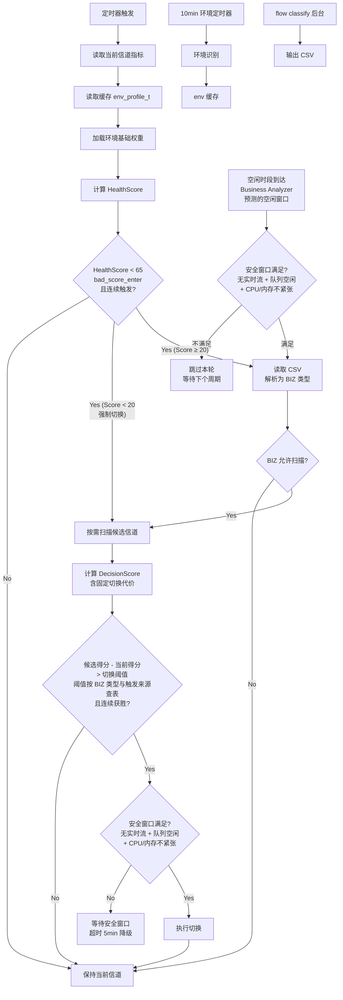

# 家用路由器 ACS 算法快速汇报

> 详见 [ACS_Algorithm_Design.md](/Users/ningjingzhiyuan/Documents/workspaces/changhong/chwfoe/doc/gpt-doc/ACS_Algorithm_Design.md)

**关键词**：家用路由器、ACS自动信道选择、环境识别、DFS雷达避让、Mesh多AP协同、业务类型识别、自学习空闲时隙预测、评分权重模型、防频繁切换保护

## 1. 定位

单/多 AP 家用路由、Mesh、DFS 5G/6G 设备。自动选最优信道。原则：**业务体验 > 吞吐**，**合规 > 性能**，**全网 > 单 AP**。

## 2. 运行流程

核心：**先守门，再比较**。绝大多数周期只算一次当前信道健康分，不扫描不切换。新增**定时全扫描**入口，在信道质量正常时也定期主动寻找更优信道。

flow classify 后台只产出 CSV 文件。主流程在需要时读取 CSV，解析为 6 类 BIZ 类型，用于判断扫描许可(J)和切换阈值(M)。切换代价固定公式，不依赖业务。

**两条入口，同一流水线**：
- **被动入口（H→Yes, Score≥20）**：当前信道 HealthScore<65 时进入，先读 CSV 解析 BIZ 类型，再经 J 节点判断是否允许扫描。切换阈值较低（8~14），解决"信道变差需要逃生"
- **强制切换（H→Yes, Score<20）**：HealthScore<20 时绕过 CSV 读取和 BIZ 门控，直接进入扫描候选信道，切换阈值降为 8。适用于信道已差到影响业务本身可用性的场景
- **主动入口（T3）**：Business Analyzer 基于 test.csv 历史数据学习用户空闲时段，预测到空闲窗口到来时触发。**空闲预测公式**：`next_slot_busy_risk = 100 × (P(CALL) + P(GAME) + 0.5×P(VIDEO))`，低于阈值 30 时视为空闲窗口（详见设计文档 §8.7.3）。进入前再校验当前安全窗口，通过后汇入 J1 主流程。BIZ 判断(J)仅 IDLE/WEB/BULK 三类允许通过，切换阈值较高（12~18），解决"信道不差但可能不是最优"

> **bad_score_enter**（触发扫描的 HealthScore 阈值）默认为 65。该值不随业务类型变化，仅决定"是否值得扫描"。HealthScore≥65 时主流程直接返回保持信道，不读取 CSV、不扫描。

**强制切换**：即使业务禁止扫描/切换（CALL/GAME），若 HealthScore < 20 则强制放开，绕过 BIZ 门控直接扫描。理由：信道过差时，切换代价小于留在烂信道的代价。

## 3. 环境识别（全网级）

跨信道全网聚合指标（全频段 BSS 总数、频段平均忙时、边缘站点占比等）→ 输出 `env_profile_t`。冷启动先加载内置默认权重，后台异步扫描后替换。

### 3.1 五类环境

| 环境 | 含义 | 典型场景 | 触发条件 | 评分侧重 |
|---|---|---|---|---|
| 强干扰 | 周边 Wi-Fi 太密，信道"很挤" | 密集公寓 | BSS ≥12(2.4G)/≥8(5G)，忙时≥45%/40% | busy/CCI/ACI |
| 弱覆盖 | 边缘信号差，"听不清" | 大户型、别墅 | SNR≤18dB，边缘站点≥30%，忙时不超标 | rate/stability/noise |
| 回程受压 | Mesh 回程差，"水管堵了" | Mesh 节点间距大 | AP≥2，回程忙时≥55%或重传≥15% | mesh |
| DFS 敏感 | 雷达频繁，"随时被赶走" | 机场、雷达站附近 | 7 天内雷达事件≥1 或 CAC 失败≥1 | dfs/stability |
| 均衡 | 无明显短板 | 普通家庭 | 未命中以上条件 | 综合优化 |

严重度 0-100，最高者为主问题。冲突优先级：DFS > 回程 > 覆盖 > 干扰 > 均衡。环境至少保持 10min。

## 4. 业务识别

后台 flow classify 守护进程持续输出 CSV → 主链路按需读取。上游 16 类原始标签 → 6 类决策业务。分类失败降级为 BIZ_WEB。

| 上游原始标签 | 决策业务 | 备注 |
|---|---|---|
| video / music | BIZ_VIDEO | 视频/流媒体 |
| game | BIZ_GAME | 游戏 |
| cloud / storage | BIZ_BULK | 大流量传输；单流≥8MB或≥4000包也归此类 |
| communication | BIZ_WEB → BIZ_CALL | 命中语音端口+持续时间后提升为 CALL |
| unknown / social / shopping / news / productivity / tech / lifestyle / finance / security / iot | BIZ_WEB | 其余11类默认映射为普通交互 |

二次修正规则：
- 15分钟内轻业务样本（total_bytes<32KB 且 total_packets<32）占比≥80% → BIZ_IDLE
- 单流 total_bytes≥8MB 或 total_packets≥4000 → 提升为 BIZ_BULK
- communication 命中语音端口+持续时间 → 提升为 BIZ_CALL
- 域名/应用命中游戏策略表 → 提升为 BIZ_GAME

## 5. 评分模型

$$DecisionScore = \sum W_i \cdot S_i,\quad \sum W_i = 1,\quad S_i \in [0,100]$$

**100=最优，0=最差。** HealthScore（阶段一，不含切换代价）vs DecisionScore（阶段二，含切换代价）。

| 环境 | Busy | CCI | ACI | Noise | Rate | Stability | Mesh | DFS | Switch |
|---|---:|---:|---:|---:|---:|---:|---:|---:|---:|
| 强干扰 | 0.20 | 0.20 | 0.14 | 0.08 | 0.12 | 0.10 | 0.04 | 0.04 | 0.08 |
| 弱覆盖 | 0.10 | 0.08 | 0.06 | 0.12 | 0.24 | 0.20 | 0.06 | 0.04 | 0.10 |
| 均衡 | 0.14 | 0.12 | 0.08 | 0.10 | 0.22 | 0.14 | 0.06 | 0.04 | 0.10 |
| 回程受压 | 0.10 | 0.10 | 0.06 | 0.08 | 0.16 | 0.12 | 0.28 | 0.04 | 0.06 |
| DFS敏感 | 0.12 | 0.12 | 0.08 | 0.08 | 0.14 | 0.16 | 0.06 | 0.18 | 0.06 |

权重 = Normalize(基础权重 + 次问题标签修正)。同类标签不重复叠加，最多叠加 2 个次问题标签，DFS 标签优先保留，叠加后归一化。业务不参与权重生成。

**切换代价**：`S = 100 - (0.45×P_realtime + 0.25×P_video + 0.30×P_sta)`。当前信道不扣分(100)，候选信道按活跃业务扣减。通话/游戏扣 45 分 → 候选基本赢不了。

## 6. 保护机制

### 业务保护

| 业务 | 扫描 | 切换 | 切换阈值 | 主动优化阈值 |
|---|---:|---:|---:|---:|
| IDLE | ✓ | ✓ | 8 | 12 |
| WEB | ✓ | ✓ | 10 | 14 |
| VIDEO | 安全窗口 | 安全窗口 | 14 | — |
| CALL | ✗ | ✗ | — | — |
| GAME | ✗ | ✗ | — | — |
| BULK | ✓ | ✓ | 12 | 18 |

> HealthScore < 20 时强制切换：所有业务放开扫描和切换，阈值降为 8。
> 主动优化阈值仅用于定时全扫描路径（右路 T3），高于被动切换阈值，避免"信道不差"时频繁切换。

### 安全窗口

`no_realtime_flow && txq<20% && retry<8% && sta≤3 && cpu<85% && 内存低压`

不满足等待，超时策略按入口区分：
- **被动入口**：5min 超时降级（txq<50%、sta≤8），降级切换后缩短冷却至 600s
- **主动入口**：2 小时超时直接放弃本轮，不降级（避免空闲窗口预测不准时频繁降级扫描）

### 防抖

`required_wins=3~5` / `degrade_confirm=3` / `min_hold=1800s`。DFS 应急冻结 30min 后自动解冻，解冻后仅限非 DFS 信道集合内恢复有限优化（切换阈值提升至 1.3 倍，防止激进切换）。

## 7. 自学习机制（概要）

### 时隙学习
每 15 分钟一个时隙（0~95），EWMA 更新：`P_new = 0.85×P_old + 0.15×O`（λ=0.85，半衰期约 65 分钟）。冷启动从 test.csv 历史导入初始频率 → 在线以时隙切换为周期（15min）增量融合。

### 漂移检测
双窗口 EWMA：P_short（λ=0.70，∼3 天）vs P_long（λ=0.95，∼21 天）。每天凌晨计算 JSD 漂移量，连续 3 天 ≥0.18 则短期权重提升到 0.7；连续 2 天 ≥0.35 立即加速通道。

### 空闲预测
`next_slot_busy_risk = 100×(P(CALL)+P(GAME)+0.5×P(VIDEO))`。低于 30 → 触发主动优化 T3。预测关闭时回退为随机安全窗口触发。

### 业务分类
16 类原始标签 → 6 类 BIZ。判定优先级：轻业务→IDLE → video/music→VIDEO → game→GAME → 大流量→BULK → cloud/storage→BULK → 其余→WEB。communication 语音提升由 `acs_classify_biz` 在线完成。

